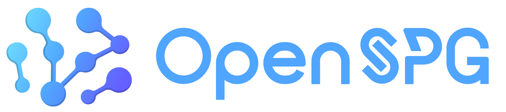
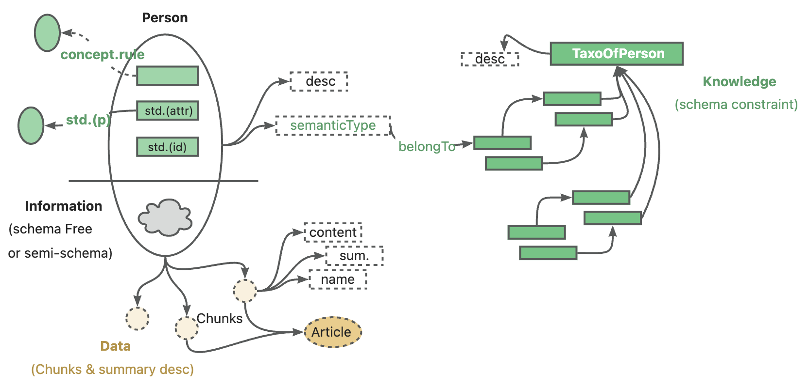
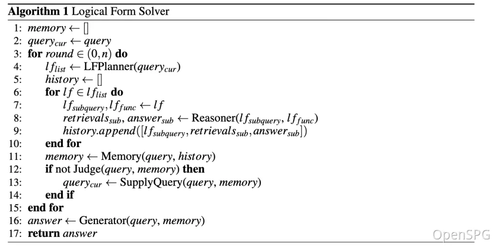
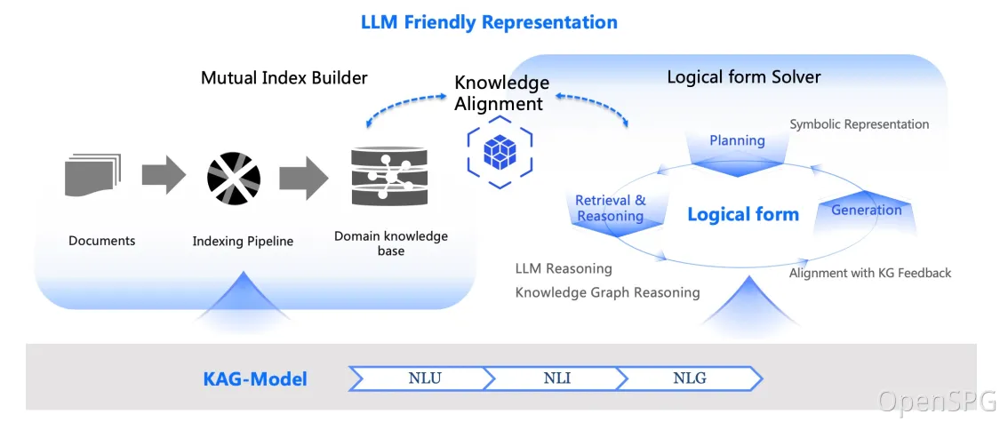
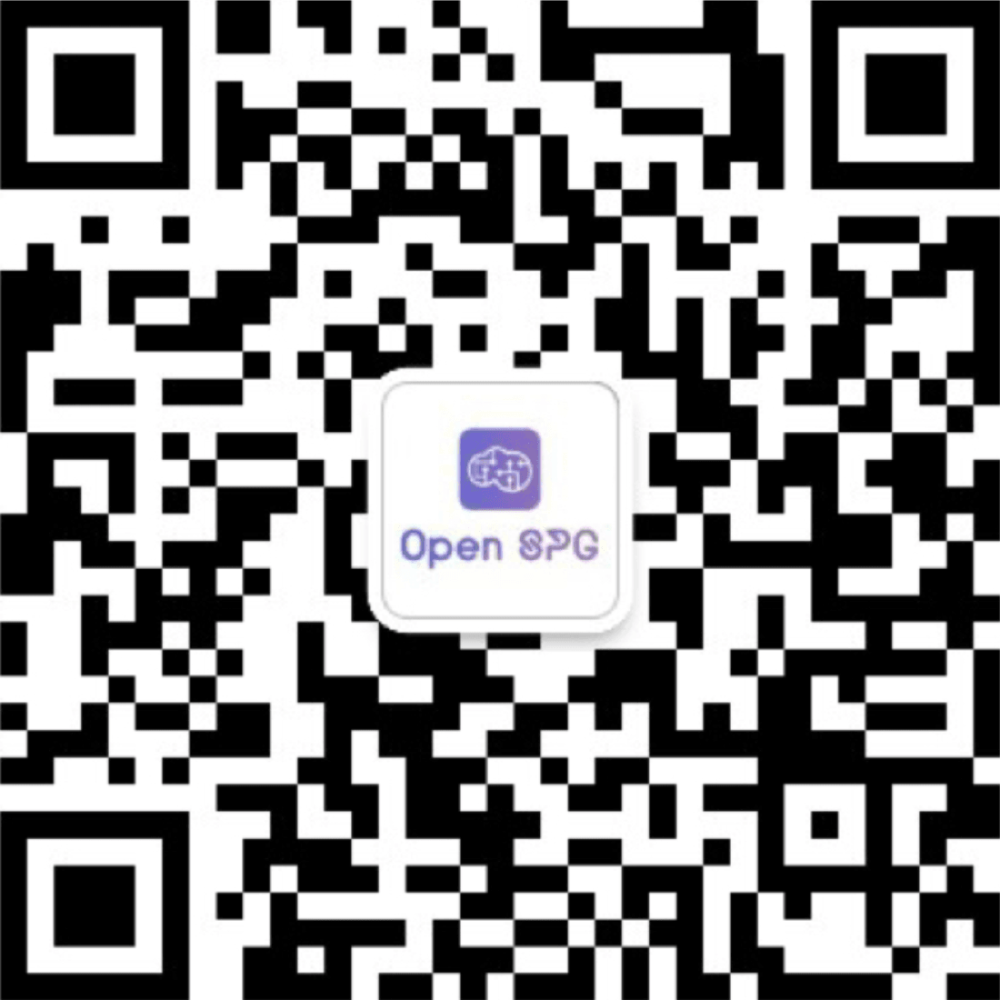
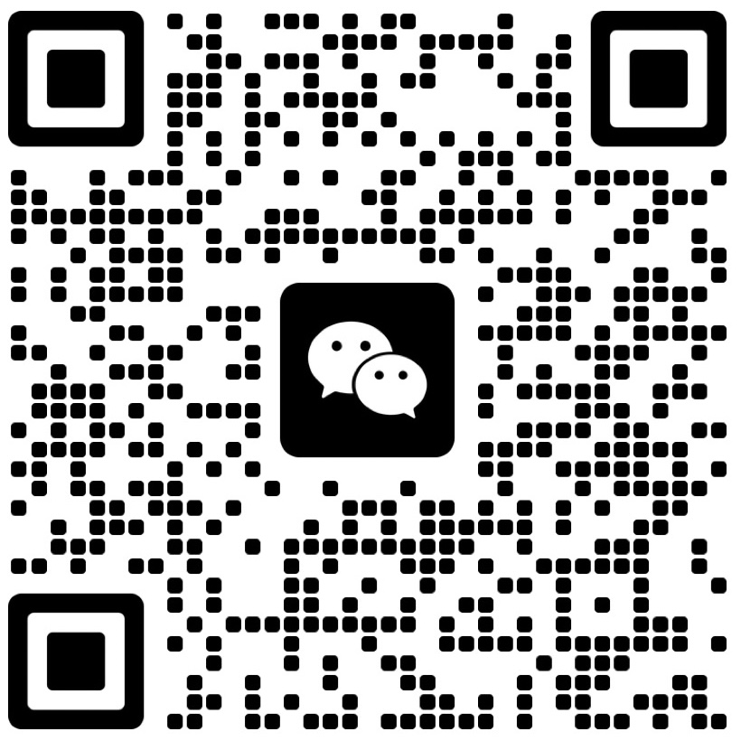

# KAG: Knowledge Augmented Generation

<div align="center">
<a href="https://spg.openkg.cn/en-US">

</a>
</div>

<p align="center">
  <a href="./README.md">English</a> |
  <a href="./README_cn.md">简体中文</a> |
  <a href="./README_ja.md">日本語版ドキュメント</a>
</p>

<p align="center">
    <a href='https://arxiv.org/pdf/2409.13731'></a>
    <a href="https://github.com/OpenSPG/KAG/releases/latest">
        
    </a>
    <a href="https://openspg.yuque.com/ndx6g9/docs_en">
        
    </a>
    <a href="https://github.com/OpenSPG/KAG/blob/main/LICENSE">
        
    </a>
    <a href="https://deepwiki.com/Like0x/KAG"></a>
</p>
<p align="center">
   <a href="https://discord.gg/PURG77zhQ7">
        
   </a>
</p>

# 1. What is KAG?

KAG is a logical reasoning and Q&A framework based on the [OpenSPG](https://github.com/OpenSPG/openspg) engine and large language models, which is used to build logical reasoning and Q&A solutions for vertical domain knowledge bases.  KAG can effectively overcome the ambiguity of traditional RAG vector similarity calculation and the noise problem of GraphRAG introduced by OpenIE.  KAG supports logical reasoning and multi-hop fact Q&A, etc., and is significantly better than the current SOTA method.

The goal of KAG is to build a knowledge-enhanced LLM service framework in professional domains, supporting logical reasoning, factual Q&A, etc. KAG fully integrates the logical and factual characteristics of the KGs. Its core features include:

- Knowledge and Chunk Mutual Indexing structure to integrate more complete contextual text information
- Knowledge alignment using conceptual semantic reasoning to alleviate the noise problem caused by OpenIE
- Schema-constrained knowledge construction to support the representation and construction of domain expert knowledge
- Logical form-guided hybrid reasoning and retrieval to support logical reasoning and multi-hop reasoning Q&A

⭐️ Star our repository to stay up-to-date with exciting new features and improvements! Get instant notifications for new releases! 🌟


# 2. Core Features

## 2.1 Knowledge Representation

In the context of private knowledge bases, unstructured data, structured information, and business expert experience often coexist. KAG references the DIKW hierarchy to upgrade SPG to a version that is friendly to LLMs. 

For unstructured data such as news, events, logs, and books, as well as structured data like transactions, statistics, and approvals, along with business experience and domain knowledge rules, KAG employs techniques such as layout analysis, knowledge extraction, property normalization, and semantic alignment to integrate raw business data and expert rules into a unified business knowledge graph.



This makes it compatible with schema-free information extraction and schema-constrained expertise construction on the same knowledge type (e. G., entity type, event type), and supports the cross-index representation between the graph structure and the original text block. 

This mutual index representation is helpful to the construction of inverted index based on graph structure, and promotes the unified representation and reasoning of logical forms.

## 2.2 Mixed Reasoning Guided by Logic Forms



KAG proposes a logically formal guided hybrid solution and inference engine. 

The engine includes three types of operators: planning, reasoning, and retrieval, which transform natural language problems into problem solving processes that combine language and notation. 

In this process, each step can use different operators, such as exact match retrieval, text retrieval, numerical calculation or semantic reasoning, so as to realize the integration of four different problem solving processes: Retrieval, Knowledge Graph reasoning, language reasoning and numerical calculation.

# 3. Release Notes

## 3.1 Latest Updates
* 2025.06.27 : Released KAG 0.8.0 Version 
  * Expanded two modes: Private Knowledge Base (including structured & unstructured data) and Public Network Knowledge Base, supporting integration of LBS, WebSearch, and other public data sources via MCP protocol.
  * Enhanced Private Knowledge Base indexing capabilities, with built-in fundamental index types such as Outline, Summary, KnowledgeUnit, AtomicQuery, Chunk, and Table.
  * Decoupled knowledge bases from applications: Knowledge Bases manage private data (structured & unstructured) and public data; Applications can associate with multiple knowledge bases and automatically adapt corresponding retrievers for data recall based on index types established during knowledge base construction.
  * Fully embraced MCP, enabling KAG-powered inference QA (via MCP protocol) within agent workflows.
  * Completed adaptation for the KAG-Thinker model. Through optimizations in breadth-wise problem decomposition, depth-wise solution derivation, knowledge boundary determination, and noise-resistant retrieval results, the framework's reasoning paradigm stability and logical rigor have been improved under the guidance of multi-round iterative thinking frameworks. 
* 2025.04.17 : Released KAG 0.7 Version 
  * First, we refactored the KAG-Solver framework. Added support for two task planning modes, static and iterative, while implementing a more rigorous knowledge layering mechanism for the reasoning phase. 
  * Second, we optimized the product experience: introduced dual modes—"Simple Mode" and "Deep Reasoning"—during the reasoning phase, along with support for streaming inference output, automatic rendering of graph indexes, and linking generated content to original references. 
  * Added an open_benchmark directory to the top level of the KAG repository, comparing various RAG methods under the same base to achieve state-of-the-art (SOTA) results. 
  * Introduced a "Lightweight Build" mode, reducing knowledge construction token costs by 89%.
* 2025.01.07 : Support domain knowledge injection, domain schema customization, QFS tasks support, Visual query analysis, enables schema-constraint mode for extraction, etc.
* 2024.11.21 : Support Word docs upload, model invoke concurrency setting, User experience optimization, etc.
* 2024.10.25 : KAG initial release

## 3.2 Future Plans

* We will continue to focus on enhancing large models' ability to leverage external knowledge bases. Our goal is to achieve bidirectional enhancement and seamless integration between large models and symbolic knowledge, improving the factuality, rigor, and consistency of reasoning and Q&A in professional scenarios. We will also keep releasing updates to push the boundaries of capability and drive adoption in vertical domains.

# 4. Quick Start

## 4.1 product-based (for ordinary users)

### 4.1.1 Engine & Dependent Image Installation

* **Recommend System Version:**

  ```text
  macOS User：macOS Monterey 12.6 or later
  Linux User：CentOS 7 / Ubuntu 20.04 or later
  Windows User：Windows 10 LTSC 2021 or later
  ```

* **Software Requirements:**

  ```text
  macOS / Linux User：Docker，Docker Compose
  Windows User：WSL 2 / Hyper-V，Docker，Docker Compose
  ```

Use the following commands to download the docker-compose.yml file and launch the services with Docker Compose.

```bash
# set the HOME environment variable (only Windows users need to execute this command)
# set HOME=%USERPROFILE%

curl -sSL https://raw.githubusercontent.com/OpenSPG/openspg/refs/heads/master/dev/release/docker-compose-west.yml -o docker-compose-west.yml
docker compose -f docker-compose-west.yml up -d
```

### 4.1.2 Use the product

Navigate to the default url of the KAG product with your browser: <http://127.0.0.1:8887>
```text
Default Username: openspg
Default password: openspg@kag
```
See [KAG usage (product mode)](https://openspg.yuque.com/ndx6g9/cwh47i/rs7gr8g4s538b1n7#rtOlA) for detailed introduction.

## 4.2 toolkit-based (for developers)

### 4.2.1 Engine & Dependent Image Installation

Refer to the 3.1 section to complete the installation of the engine & dependent image.

### 4.2.2 Installation of KAG


**macOS / Linux developers**

```text
# Create conda env: conda create -n kag-demo python=3.10 && conda activate kag-demo

# Clone code: git clone https://github.com/OpenSPG/KAG.git

# Install KAG: cd KAG && pip install -e .
```

**Windows developers**

```text
# Install the official Python 3.10 or later, install Git.

# Create and activate Python venv: py -m venv kag-demo && kag-demo\Scripts\activate

# Clone code: git clone https://github.com/OpenSPG/KAG.git

# Install KAG: cd KAG && pip install -e .
```

### 4.2.3 Use the toolkit

Please refer to [KAG usage (developer mode)](https://openspg.yuque.com/ndx6g9/cwh47i/rs7gr8g4s538b1n7#cikso) guide for detailed introduction of the toolkit. Then you can use the built-in components to reproduce the performance results of the built-in datasets, and apply those components to new busineness scenarios.

# 5. Technical Architecture



The KAG framework includes three parts: kg-builder, kg-solver, and kag-model. This release only involves the first two parts, kag-model will be gradually open source release in the future.

kg-builder implements a knowledge representation that is friendly to large-scale language models (LLM). Based on the hierarchical structure of DIKW (data, information, knowledge and wisdom), IT upgrades SPG knowledge representation ability, and is compatible with information extraction without schema constraints and professional knowledge construction with schema constraints on the same knowledge type (such as entity type and event type), it also supports the mutual index representation between the graph structure and the original text block, which supports the efficient retrieval of the reasoning question and answer stage.

kg-solver uses a logical symbol-guided hybrid solving and reasoning engine that includes three types of operators: planning, reasoning, and retrieval, to transform natural language problems into a problem-solving process that combines language and symbols. In this process, each step can use different operators, such as exact match retrieval, text retrieval, numerical calculation or semantic reasoning, so as to realize the integration of four different problem solving processes: Retrieval, Knowledge Graph reasoning, language reasoning and numerical calculation.

# 6. Community & Support

**GitHub**: <https://github.com/OpenSPG/KAG>

**Website**: <https://openspg.github.io/v2/docs_en>

## Discord <a href="https://discord.gg/PURG77zhQ7"> </a>

Join our [Discord](https://discord.gg/PURG77zhQ7) community.

## WeChat

Follow OpenSPG Official Account to get technical articles and product updates about OpenSPG and KAG.



Scan the QR code below to join our WeChat group. 




# 7. Differences between KAG, RAG, and GraphRAG

**KAG introduction and applications**: <https://github.com/orgs/OpenSPG/discussions/52>

# 8. Citation

If you use this software, please cite it as below:

* [KAG: Boosting LLMs in Professional Domains via Knowledge Augmented Generation](https://arxiv.org/abs/2409.13731)

* KGFabric: A Scalable Knowledge Graph Warehouse for Enterprise Data Interconnection

```bibtex
@article{liang2024kag,
  title={KAG: Boosting LLMs in Professional Domains via Knowledge Augmented Generation},
  author={Liang, Lei and Sun, Mengshu and Gui, Zhengke and Zhu, Zhongshu and Jiang, Zhouyu and Zhong, Ling and Zhao, Peilong and Bo, Zhongpu and Yang, Jin and others},
  journal={arXiv preprint arXiv:2409.13731},
  year={2024}
}

@article{yikgfabric,
  title={KGFabric: A Scalable Knowledge Graph Warehouse for Enterprise Data Interconnection},
  author={Yi, Peng and Liang, Lei and Da Zhang, Yong Chen and Zhu, Jinye and Liu, Xiangyu and Tang, Kun and Chen, Jialin and Lin, Hao and Qiu, Leijie and Zhou, Jun}
}
```

# License

[Apache License 2.0](LICENSE)

# KAG Core Team
Lei Liang, Mengshu Sun, Zhengke Gui, Zhongshu Zhu, Zhouyu Jiang, Ling Zhong, Peilong Zhao, Zhongpu Bo, Jin Yang, Huaidong Xiong, Lin Yuan, Jun Xu, Zaoyang Wang, Zhiqiang Zhang, Wen Zhang, Huajun Chen, Wenguang Chen, Jun Zhou, Haofen Wang
