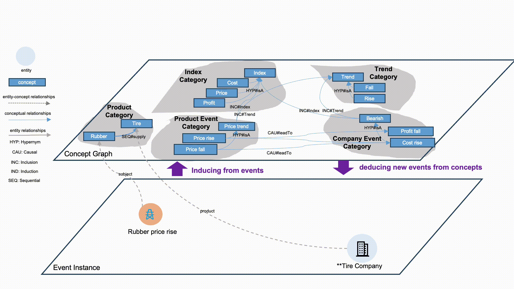

# KAG: Knowledge Augmented Generation

<div align="center">
<a href="https://spg.openkg.cn/en-US">

</a>
</div>

<p align="center">
  <a href="./README.md">English</a> |
  <a href="./README_cn.md">简体中文</a> |
  <a href="./README_ja.md">日本語版ドキュメント</a>
</p>

<p align="center">
    <a href='https://arxiv.org/pdf/2409.13731'></a>
    <a href="https://github.com/OpenSPG/KAG/releases/latest">
        
    </a>
    <a href="https://openspg.yuque.com/ndx6g9/docs_en">
        
    </a>
    <a href="https://github.com/OpenSPG/KAG/blob/main/LICENSE">
        
    </a>
</p>
<p align="center">
   <a href="https://discord.gg/PURG77zhQ7">
        
   </a>
</p>

<div align="center">
  
</div>

# 1. What is KAG?

KAG (Knowledge Augmented Generation) is a framework designed for logical reasoning and answering questions. It uses the [OpenSPG](https://github.com/OpenSPG/openspg) engine and Large Language Models (LLMs) to create solutions for knowledge bases in specific industries or fields. KAG aims to solve common problems found in other methods: it reduces the vagueness of traditional RAG (Retrieval Augmented Generation) which relies on vector similarity, and minimizes the errors (noise) that can occur with GraphRAG due to its OpenIE (Open Information Extraction) methods. KAG excels at tasks requiring logical reasoning and answering questions that need multiple steps of fact-finding, performing significantly better than current leading methods.

The main goal of KAG is to provide an LLM service framework enhanced by knowledge, especially for professional fields. This allows for robust logical reasoning and accurate question answering. KAG leverages the strengths of Knowledge Graphs (KGs) by focusing on their logical and factual aspects. Key features include:

- **Mutual Indexing of Knowledge and Text Chunks:** This creates a more complete understanding by linking knowledge graph information directly with relevant parts of the original text.
- **Conceptual Semantic Reasoning for Knowledge Alignment:** This helps to clean up and reduce errors that might arise from automated information extraction (like OpenIE).
- **Schema-Constrained Knowledge Construction:** This allows domain experts to accurately represent and build their specialized knowledge within the system.
- **Logic-Form-Guided Hybrid Reasoning and Retrieval:** This supports complex reasoning, including multi-step logical deductions and answering questions that require finding information across different parts of the knowledge base.

<div align="center">
  <p><strong>⭐️ Star our repository to stay up-to-date with exciting new features and improvements! Get instant notifications for new releases! 🌟</strong></p>
  <p><a href="https://github.com/OpenSPG/KAG/stargazers"></a></p>
</div>

# 2. Core Features

## 2.1 Knowledge Representation

Many organizations have knowledge in various forms: unstructured data (like articles and logs), structured data (like databases and spreadsheets), and the valuable experience of their experts. KAG helps manage this diverse information. It draws inspiration from the DIKW hierarchy (Data, Information, Knowledge, Wisdom) and enhances OpenSPG to work effectively with LLMs.

KAG processes different types of data—such as news articles, event logs, books, transaction records, statistical data, and approval forms—along with expert insights and domain-specific rules. It uses methods like layout analysis, knowledge extraction, property normalization, and semantic alignment. This transforms raw business data and expert rules into a single, unified business knowledge graph.


This approach allows KAG to handle both flexible information extraction (without strict rules) and structured knowledge building (based on expert rules) for the same types of information (e.g., types of entities or events). It also supports a two-way indexing system that links the graph structure with the original text.

This mutual indexing is key for building efficient search capabilities based on the graph's structure and helps create a unified way to represent and reason with information using logical forms.

## 2.2 Mixed Reasoning Guided by Logic Forms


KAG introduces an advanced reasoning engine that uses logical forms to guide its problem-solving process. This engine combines different approaches to find answers.

The engine uses three main types of operations:
- **Planning:** Figuring out the steps needed to answer a question.
- **Reasoning:** Using logic to deduce new information.
- **Retrieval:** Finding relevant information from the knowledge base or text.

These operations work together to turn complex natural language questions into a structured problem-solving process that uses both language understanding and symbolic logic.

At each step, the system can choose the best operation for the task, whether it's finding an exact match, searching through text, performing calculations, or using semantic reasoning. This allows KAG to seamlessly integrate four different problem-solving methods: simple retrieval, knowledge graph reasoning, language-based reasoning, and numerical computation.

# 3. Illustrative Examples

KAG excels at building systems for complex question answering over private knowledge bases, performing multi-hop reasoning to connect disparate pieces of information, and integrating domain-specific expertise into LLM workflows. It's designed to tackle challenges where deep understanding and logical deduction from structured and unstructured data are paramount.

For detailed, runnable examples that showcase KAG's capabilities in various scenarios, please see our [Examples Collection](./kag/examples/README.md).

Here are a couple of specific applications:

*   **Supply Chain Analysis:** Explore how KAG can be used to construct and query an enterprise supply chain knowledge graph, enabling insights into supplier relationships, industry connections, and event impacts. See the [Supply Chain Example](./kag/examples/supplychain/README.md) for more details.
*   **Medical Knowledge Q&A:** Discover how KAG can build a medical knowledge graph from various data sources (structured and unstructured) to answer complex medical questions and support healthcare applications. Check out the [Medicine Example](./kag/examples/medicine/README.md).

These examples provide hands-on experience with KAG's features and demonstrate its potential in real-world use cases.

# 4. Release Notes

## 4.1 Latest Updates

* 2025.04.17 : Released KAG 0.7 Version 
  * First, we refactored the KAG-Solver framework. Added support for two task planning modes, static and iterative, while implementing a more rigorous knowledge layering mechanism for the reasoning phase. 
  * Second, we optimized the product experience: introduced dual modes—"Simple Mode" and "Deep Reasoning"—during the reasoning phase, along with support for streaming inference output, automatic rendering of graph indexes, and linking generated content to original references. 
  * Added an open_benchmark directory to the top level of the KAG repository, comparing various RAG methods under the same base to achieve state-of-the-art (SOTA) results. 
  * Introduced a "Lightweight Build" mode, reducing knowledge construction token costs by 89%.

For a full list of changes, see the [Release Notes](./docs/release_notes.md).

## 4.2 Future Plans

* Logical reasoning optimization, conversational tasks support
* kag-model release, kag solution for event reasoning knowledge graph and medical knowledge graph
* kag front-end open source, distributed build support, mathematical reasoning optimization

# 5. Quick Start

## 4.1 product-based (for ordinary users)

### 4.1.1 Engine & Dependent Image Installation

* **Recommend System Version:**

  ```text
  macOS User：macOS Monterey 12.6 or later
  Linux User：CentOS 7 / Ubuntu 20.04 or later
  Windows User：Windows 10 LTSC 2021 or later
  ```

* **Software Requirements:**

  ```text
  macOS / Linux User：Docker，Docker Compose
  Windows User：WSL 2 / Hyper-V，Docker，Docker Compose
  ```

Use the following commands to download the docker-compose.yml file and launch the services with Docker Compose.

```bash
# set the HOME environment variable (only Windows users need to execute this command)
# set HOME=%USERPROFILE%

curl -sSL https://raw.githubusercontent.com/OpenSPG/openspg/refs/heads/master/dev/release/docker-compose-west.yml -o docker-compose-west.yml
docker compose -f docker-compose-west.yml up -d
```

### 4.1.2 Use the product

Navigate to the default url of the KAG product with your browser: <http://127.0.0.1:8887>
```text
Default Username: openspg
Default password: openspg@kag
```
<!-- TODO: Add Product-Based Demo GIF/Video Here. Should show a brief walkthrough of the KAG product interface, e.g., navigating to the URL, logging in, and a simple Q&A interaction. -->

See [KAG usage (product mode)](https://openspg.yuque.com/ndx6g9/cwh47i/rs7gr8g4s538b1n7#rtOlA) for detailed introduction.

## 4.2 toolkit-based (for developers)

### 4.2.1 Engine & Dependent Image Installation

Refer to the **Engine & Dependent Image Installation** instructions in the 'product-based (for ordinary users)' section above.

### 4.2.2 Installation of KAG


**macOS / Linux developers**

```text
# Create conda env: conda create -n kag-demo python=3.10 && conda activate kag-demo

# Clone code: git clone https://github.com/OpenSPG/KAG.git

# Install KAG: cd KAG && pip install -e .
```

**Windows developers**

```text
# Install the official Python 3.8.10 or later, install Git.

# Create and activate Python venv: py -m venv kag-demo && kag-demo\Scripts\activate

# Clone code: git clone https://github.com/OpenSPG/KAG.git

# Install KAG: cd KAG && pip install -e .
```

### 4.2.3 Use the toolkit

<!-- TODO: Add Toolkit-Based Demo GIF/Video Here. Should show a terminal session demonstrating KAG installation via pip and a basic command-line usage example. -->

Please refer to [KAG usage (developer mode)](https://openspg.yuque.com/ndx6g9/cwh47i/rs7gr8g4s538b1n7#cikso) guide for detailed introduction of the toolkit. Then you can use the built-in components to reproduce the performance results of the built-in datasets, and apply those components to new business scenarios.

# 6. Technical Architecture


The KAG framework includes three parts: kg-builder, kg-solver, and kag-model. This release only involves the first two parts, kag-model will be gradually open source release in the future.

kg-builder implements a knowledge representation that is friendly to large-scale language models (LLM). Based on the hierarchical structure of DIKW (data, information, knowledge and wisdom), IT upgrades SPG knowledge representation ability, and is compatible with information extraction without schema constraints and professional knowledge construction with schema constraints on the same knowledge type (such as entity type and event type), it also supports the mutual index representation between the graph structure and the original text block, which supports the efficient retrieval of the reasoning question and answer stage.

kg-solver uses a logical symbol-guided hybrid solving and reasoning engine that includes three types of operators: planning, reasoning, and retrieval, to transform natural language problems into a problem-solving process that combines language and symbols. In this process, each step can use different operators, such as exact match retrieval, text retrieval, numerical calculation or semantic reasoning, so as to realize the integration of four different problem solving processes: Retrieval, Knowledge Graph reasoning, language reasoning and numerical calculation.

# 7. Contributing

We welcome contributions to KAG! If you're interested in helping improve the project, please see our [Contributing Guidelines](./CONTRIBUTING.md) for more information on how to get started, report issues, and submit pull requests.

# 8. Community & Support

**GitHub**: <https://github.com/OpenSPG/KAG>

**Website**: <https://openspg.github.io/v2/docs_en>

## Discord <a href="https://discord.gg/PURG77zhQ7"> </a>

Join our [Discord](https://discord.gg/PURG77zhQ7) community.

## WeChat

Follow OpenSPG Official Account to get technical articles and product updates about OpenSPG and KAG.


Scan the QR code below to join our WeChat group. 


# 9. Differences between KAG, RAG, and GraphRAG

**KAG introduction and applications**: <https://github.com/orgs/OpenSPG/discussions/52>

# 10. Citation

If you use this software, please cite it as below:

* [KAG: Boosting LLMs in Professional Domains via Knowledge Augmented Generation](https://arxiv.org/abs/2409.13731)

* KGFabric: A Scalable Knowledge Graph Warehouse for Enterprise Data Interconnection

```bibtex
@article{liang2024kag,
  title={KAG: Boosting LLMs in Professional Domains via Knowledge Augmented Generation},
  author={Liang, Lei and Sun, Mengshu and Gui, Zhengke and Zhu, Zhongshu and Jiang, Zhouyu and Zhong, Ling and Zhao, Peilong and Bo, Zhongpu and Yang, Jin and others},
  journal={arXiv preprint arXiv:2409.13731},
  year={2024}
}

@article{yikgfabric,
  title={KGFabric: A Scalable Knowledge Graph Warehouse for Enterprise Data Interconnection},
  author={Yi, Peng and Liang, Lei and Da Zhang, Yong Chen and Zhu, Jinye and Liu, Xiangyu and Tang, Kun and Chen, Jialin and Lin, Hao and Qiu, Leijie and Zhou, Jun}
}
```

# License

[Apache License 2.0](LICENSE)

# KAG Core Team
Lei Liang, Mengshu Sun, Zhengke Gui, Zhongshu Zhu, Zhouyu Jiang, Ling Zhong, Peilong Zhao, Zhongpu Bo, Jin Yang, Huaidong Xiong, Lin Yuan, Jun Xu, Zaoyang Wang, Zhiqiang Zhang, Wen Zhang, Huajun Chen, Wenguang Chen, Jun Zhou, Haofen Wang
