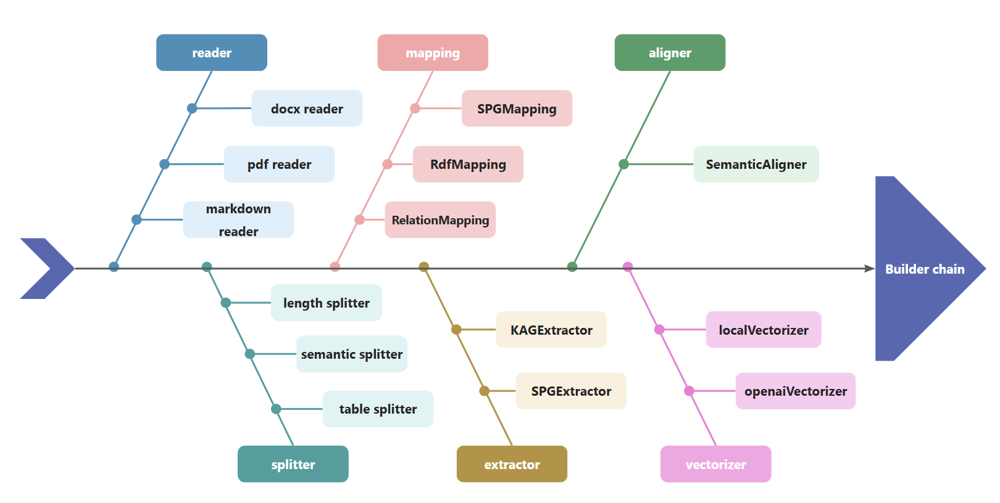

# KAG: Knowledge Augmented Generation

[中文版文档](./README_cn.md)
[日本語版ドキュメント](./README_ja.md)

## 1. What is KAG

Retrieval Augmentation Generation (RAG) technology promotes the integration of domain applications with large language models. However, RAG has problems such as a large gap between vector similarity and knowledge reasoning correlation, and insensitivity to knowledge logic (such as numerical values, time relationships, expert rules, etc.), which hinder the implementation of professional knowledge services.

On October 24, 2024, OpenSPG released v0.5, officially releasing the professional domain knowledge service framework of knowledge augmented generation (KAG). The goal of KAG is to build a knowledge-enhanced LLM service framework in professional domains, supporting logical reasoning, factual Q&A, etc. KAG fully integrates the logical and factual characteristics of the KGs. Meanwhile, it uses OpenIE to lower the threshold for knowledgeization of domain documents and alleviates the sparsity problem of the KG through hybrid reasoning. As far as we know, KAG is the only RAG framework that supports logical reasoning and multi-hop factual Q&A. Its core features include:

* Knowledge and Chunk Mutual Indexing structure to integrate more complete contextual text information
* Knowledge alignment using conceptual semantic reasoning to alleviate the noise problem caused by OpenIE
* Schema-constrained knowledge construction to support the representation and construction of domain expert knowledge
* Logical form-guided hybrid reasoning and retrieval to support logical reasoning and multi-hop reasoning Q&A

KAG is significantly better than NaiveRAG, HippoRAG and other methods in multi-hop Q&A tasks. The F1 score on hotpotQA is relatively increased by 19.6%, and the F1 score on 2wiki is relatively increased by 33.5%. We have successfully applied KAG to Ant Group's professional knowledge Q&A tasks, such as e-government Q&A and e-health Q&A, and the professionalism has been significantly improved compared to the traditional RAG method.

⭐️ Star our repository to stay up-to-date with exciting new features and improvements! Get instant notifications for new releases! 🌟


### 1.1 Technical Architecture


The KAG framework includes three parts: kg-builder, kg-solver, and kag-model. This release only involves the first two parts, kag-model will be gradually open source release in the future.

kg-builder implements a knowledge representation that is friendly to large-scale language models (LLM). Based on the hierarchical structure of DIKW (data, information, knowledge and wisdom), IT upgrades SPG knowledge representation ability, and is compatible with information extraction without schema constraints and professional knowledge construction with schema constraints on the same knowledge type (such as entity type and event type), it also supports the mutual index representation between the graph structure and the original text block, which supports the efficient retrieval of the reasoning question and answer stage.

kg-solver uses a logical symbol-guided hybrid solving and reasoning engine that includes three types of operators: planning, reasoning, and retrieval, to transform natural language problems into a problem-solving process that combines language and symbols. In this process, each step can use different operators, such as exact match retrieval, text retrieval, numerical calculation or semantic reasoning, so as to realize the integration of four different problem solving processes: Retrieval, Knowledge Graph reasoning, language reasoning and numerical calculation.

### 1.2 Knowledge Representation

In the context of private knowledge bases, unstructured data, structured information, and business expert experience often coexist. KAG references the DIKW hierarchy to upgrade SPG to a version that is friendly to LLMs. For unstructured data such as news, events, logs, and books, as well as structured data like transactions, statistics, and approvals, along with business experience and domain knowledge rules, KAG employs techniques such as layout analysis, knowledge extraction, property normalization, and semantic alignment to integrate raw business data and expert rules into a unified business knowledge graph.


This makes it compatible with schema-free information extraction and schema-constrained expertise construction on the same knowledge type (e. G., entity type, event type), and supports the cross-index representation between the graph structure and the original text block. This mutual index representation is helpful to the construction of inverted index based on graph structure, and promotes the unified representation and reasoning of logical forms.

### 1.3 Mixed Reasoning Guided by Logic Forms


KAG proposes a logically formal guided hybrid solution and inference engine. The engine includes three types of operators: planning, reasoning, and retrieval, which transform natural language problems into problem solving processes that combine language and notation. In this process, each step can use different operators, such as exact match retrieval, text retrieval, numerical calculation or semantic reasoning, so as to realize the integration of four different problem solving processes: Retrieval, Knowledge Graph reasoning, language reasoning and numerical calculation.

## 2. How is the effect?

### 2.1 the effect of public data sets (multi-hop reasoning)


After optimization, we not only verified the adaptability of KAG in vertical fields, but also compared it with the existing RAG method in the multi-hop Question and Answer of general data sets. We found that it is obviously better than SOTA method, with F1 increasing by 33.5% on 2wiki and 19.6% on hotpotQA. We are continuing to refine this framework and have demonstrated its effectiveness through end-to-end experiments and ablation experiment metrics. We demonstrate the validity of this framework by means of logic-symbol-driven reasoning and conceptual alignment.

### 2.2 the effect of domain knowledge scenarios (risk mining)

#### 2.2.1 Definition of Expert Rules

* definition of "gambling APP" identification rules

  **define riskAppTaxo rule**

  ```text
  Define (s:App)-[p:belongTo]->(o:`TaxOfRiskApp`/`GamblingApp`) {
      Structure {
          (s)
      }
      Constraint {
          R1("risk label marked as gambling") s.riskMark like "%Gambling%"
    }
  }
  ```

* define the "App developer" identification rules

  **define app developper rule**

  ```text
  Define (s:Person)-[p:developed]->(o:App) {
      Structure {
          (s)-[:hasDevice]->(d:Device)-[:install]->(o)
      }
      Constraint {
          deviceNum = group(s,o).count(d)
          R1("device installed same app"): deviceNum > 5
      }
  }
  ```

* define the rules for the identification of "gambling App developers"

  **define a RiskUser of gambling app rule**

  ```text
  Define (s:Person)-[p:belongTo]->(o:`TaxOfRiskUser`/`DeveloperOfGamblingApp`) {
      Structure {
          (s)-[:developed]->(app:`TaxOfRiskApp`/`GamblingApp`)
      }
      Constraint {
      }
  }
  ```

#### 2.2.2 Business Data


#### 2.2.3 Reasoning Process


The key steps in the reasoning process are as follows.

* Convert natural language problems into executable logical expressions, which rely on Conceptual Modeling under the project, and refer to the Black product mining document.

* Submit the converted logical expression to the OpenSPG reasoner for execution to obtain the user classification result.

* Generate answers to the user's classification results.

Combined with OpenSPG concept modeling, KAG can reduce the difficulty of natural language conversion graph query, change data-oriented conversion to classification concept-oriented conversion, and quickly realize the field application of natural language question and answer on the original OpenSPG project.

## 3. How to use it

### 3.1 product-based (for ordinary users)

#### 3.1.1 Engine & Dependent Image Installation

* **Recommend System Version:**

  ```text
  macOS User：macOS Monterey 12.6 or later
  Linux User：CentOS 7 / Ubuntu 20.04 or later
  Windows User：Windows 10 LTSC 2021 or later
  ```

* **Software Requirements:**

  ```text
  macOS / Linux User：Docker，Docker Compose
  Windows User：WSL 2 / Hyper-V，Docker，Docker Compose
  ```

Use the following commands to download the docker-compose.yml file and launch the services with Docker Compose.

```bash
# set the HOME environment variable (only Windows users need to execute this command)
# set HOME=%USERPROFILE%

curl -sSL https://raw.githubusercontent.com/OpenSPG/openspg/refs/heads/master/dev/release/docker-compose.yml -o docker-compose.yml
docker compose -f docker-compose.yml up -d
```

#### 3.1.2 Use the product

Navigate to the default url of the KAG product with your browser: <http://127.0.0.1:8887>

See the [Product](https://openspg.yuque.com/ndx6g9/wc9oyq/rgd8ecefccwd1ga5) guide for detailed introduction.

### 3.2 toolkit-based (for developers)

#### 3.2.1 Engine & Dependent Image Installation

Refer to the 3.1 section to complete the installation of the engine & dependent image.

#### 3.2.2 Installation of KAG

**macOS / Linux developers**

```text
# Create conda env: conda create -n kag-demo python=3.10 && conda activate kag-demo

# Clone code: git clone https://github.com/OpenSPG/KAG.git

# Install KAG: cd KAG && pip install -e .
```

**Windows developers**

```text
# Install the official Python 3.8.10 or later, install Git.

# Create and activate Python venv: py -m venv kag-demo && kag-demo\Scripts\activate

# Clone code: git clone https://github.com/OpenSPG/KAG.git

# Install KAG: cd KAG && pip install -e .
```

#### 3.2.3 Use the toolkit

Please refer to the [Quick Start](https://openspg.yuque.com/ndx6g9/wc9oyq/owp4sxbdip2u7uvv) guide for detailed introduction of the toolkit. Then you can use the built-in components to reproduce the performance results of the built-in datasets, and apply those components to new busineness scenarios.

## 4. How to extend

### 4.1 Extend KAG capability

If the built-in components provided by KAG do not meet your requirements, you can extend the kag-builder and kag-solver implementation on your own. Please refer to [KAG-Builder Extension](https://openspg.yuque.com/ndx6g9/wc9oyq/ky9swve8g0qfk9zm) and [KAG-Solver Extension](https://openspg.yuque.com/ndx6g9/wc9oyq/kr6m15dc84apobe7).

#### 4.1.1 kag-builder Extension



KAG uses BuilderChain to concatenate components such as reader, splitter, mapping, extractor, aligner, and vectorizer. Developers can use the BuilderChain predefined by kag to complete graph construction, or assemble predefined components and obtain BuilderChain.

At the same time, developers can customize the components in the builder and embed them in the BuilderChain for execution.

```text
kag
├──interface
│  ├── builder
│  │   ├── aligner_abc.py
│  │   ├── extractor_abc.py
│  │   ├── mapping_abc.py
│  │   ├── reader_abc.py
│  │   ├── splitter_abc.py
│  │   ├── vectorizer_abc.py
│  │   └── writer_abc.py
```

#### 4.1.2 kag-solver Extension

The kag-solver executes solver-pipelines consisting of reasoner, generator, and reflector components. KAG provides default reasoner, generator, and reflector. Developers can also provide custom implementations based on the following APIs:

```text
kag
├── solver
│   ├── logic
│   │   └── solver_pipeline.py
├── interface
    ├── retriever
    │   ├── chunk_retriever_abc.py
    │   └── kg_retriever_abc.py
    └── solver
        ├── kag_generator_abc.py
        ├── kag_memory_abc.py
        ├── kag_reasoner_abc.py
        ├── kag_reflector_abc.py
        └── lf_planner_abc.py
```

### 4.2 KAG adapted to custom models

#### 4.2.1 Generative model adaptation

KAG supports docking with MaaS APIs compatible with OpenAI services such as Qwen / DeepSeek / GPT, and also supports docking with local models deployed by vLLM / Ollama. Developers can add support for custom model services based on the llm_client interface.

```text
kag
├── common
  ├── llm
    ├── client
    │   ├── llm_client.py
    │   ├── ollama_client.py
    │   ├── openai_client.py
    │   ├── vllm_client.py
```

#### 4.2.2 Representational model adaptation

KAG supports calling the OpenAI representational models and the like, including OpenAI embedding services, bge-m3 model deployed by Ollama. It also supports loading and using local embedding models.

```text
kag
├── common
  ├── vectorizer
  │   ├── vectorizer.py
  │   ├── openai_vectorizer.py
  │   ├── local_bge_m3_vectorizer.py
  │   ├── local_bge_vectorizer.py
```

### 4.3 KAG integrated with other frameworks

When integrated with other frameworks, external business data & expert knowledge can be used as input to call the kag-builder pipeline to complete the knowledge graph construction. You can also call the kag-solver to complete the Q&A reasoning process, and the reasoning result and intermediate process is revealed to the business system.

The way other frameworks integrate kag can be simply described as:


## 5. Follow-up plan

* domain knowledge injection to realize the fusion of domain concept graph and entity graph

* kag-model optimization to improve the efficiency of KG construction and Q&A

* hallucination inhibition of knowledge logic constraints

## 6. Contact us

**GitHub**: <https://github.com/OpenSPG/KAG>

**OpenSPG**: <https://spg.openkg.cn/>


# Cite

If you use this software, please cite it as below:

* [KAG: Boosting LLMs in Professional Domains via Knowledge Augmented Generation](https://arxiv.org/abs/2409.13731)

* KGFabric: A Scalable Knowledge Graph Warehouse for Enterprise Data Interconnection

```bibtex
@article{liang2024kag,
  title={KAG: Boosting LLMs in Professional Domains via Knowledge Augmented Generation},
  author={Liang, Lei and Sun, Mengshu and Gui, Zhengke and Zhu, Zhongshu and Jiang, Zhouyu and Zhong, Ling and Qu, Yuan and Zhao, Peilong and Bo, Zhongpu and Yang, Jin and others},
  journal={arXiv preprint arXiv:2409.13731},
  year={2024}
}

@article{yikgfabric,
  title={KGFabric: A Scalable Knowledge Graph Warehouse for Enterprise Data Interconnection},
  author={Yi, Peng and Liang, Lei and Da Zhang, Yong Chen and Zhu, Jinye and Liu, Xiangyu and Tang, Kun and Chen, Jialin and Lin, Hao and Qiu, Leijie and Zhou, Jun}
}
```

# License

[Apache License 2.0](LICENSE)
