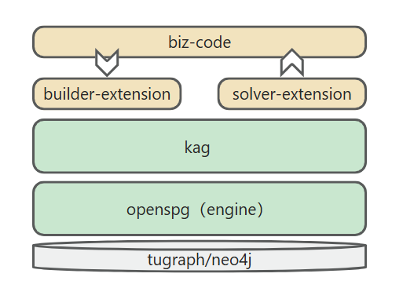

# 大模型知识服务框架 KAG

## 1. KAG 是什么

检索增强生成（RAG）技术推动了领域应用与大模型结合。然而，RAG 存在着向量相似度与知识推理相关性差距大、对知识逻辑（如数值、时间关系、专家规则等）不敏感等问题，这些都阻碍了专业知识服务的落地。

2024 年 10 月 24 日，OpenSPG 发布 v0.5 版本，正式发布了知识增强生成（KAG）的专业领域知识服务框架。KAG 旨在充分利用知识图谱和向量检索的优势，并通过四个方面双向增强大型语言模型和知识图谱，以解决 RAG 挑战：(1) 对 LLM 友好的知识表示，(2) 知识图谱与原文片段之间的互索引，(3) 逻辑形式引导的混合推理引擎，(4) 与语义推理的知识对齐。

KAG 在多跳问答任务中显著优于 NaiveRAG、HippoRAG 等方法，在 hotpotQA 上的 F1 分数相对提高了 19.6%，在 2wiki 上的 F1 分数相对提高了 33.5%。我们已成功将 KAG 应用于蚂蚁集团的两个专业知识问答任务，包括电子政务问答和电子健康问答，与 RAG 方法相比，专业性有了显著提高。

### 1.1 技术架构


图1 KAG 技术架构

KAG 框架包括 kg-builder、kg-solver、kag-model 三部分。本次发布只涉及前两部分，kag-model 将在后续逐步开源发布。

kg-builder 实现了一种对大型语言模型（LLM）友好的知识表示，在 DIKW（数据、信息、知识和智慧）的层次结构基础上，升级 SPG 知识表示能力，在同一知识类型（如实体类型、事件类型）上兼容无 schema 约束的信息提取和有 schema 约束的专业知识构建，并支持图结构与原始文本块之间的互索引表示，为推理问答阶段的高效检索提供支持。

kg-solver 采用逻辑形式引导的混合求解和推理引擎，该引擎包括三种类型的运算符：规划、推理和检索，将自然语言问题转化为结合语言和符号的问题求解过程。在这个过程中，每一步都可以利用不同的运算符，如精确匹配检索、文本检索、数值计算或语义推理，从而实现四种不同问题求解过程的集成：检索、知识图谱推理、语言推理和数值计算。

### 1.2 知识表示

私域知识库场景，非结构化数据、结构化信息、业务专家经验 往往三者共存，KAG 参考了 DIKW 层次结构，将 SPG 升级为对 LLM 友好的版本。针对新闻、事件、日志、书籍等非结构化数据，交易、统计、审批等结构化数据，业务经验、领域知识等规则，KAG 采用版面分析、知识抽取、属性标化、语义对齐等技术，将原始的业务数据&专家规则融合到统一的业务知识图谱中。


这使得它能够在同一知识类型（如实体类型、事件类型）上兼容无 schema 约束的信息提取和有 schema 约束的专业知识构建，并支持图结构与原始文本块之间的互索引表示。这种互索引表示有助于基于图结构的倒排索引的构建，并促进了逻辑形式的统一表示、推理。

### 1.3 逻辑形式引导的混合推理


KAG 提出了一种逻辑形式引导的混合求解和推理引擎。该引擎包括三种类型的运算符：规划、推理和检索，将自然语言问题转化为结合语言和符号的问题求解过程。在这个过程中，每一步都可以利用不同的运算符，如精确匹配检索、文本检索、数值计算或语义推理，从而实现四种不同问题求解过程的集成：检索、知识图谱推理、语言推理和数值计算。

## 2. 效果如何

### 2.1 公开数据集的效果（多跳推理）


经过优化，我们不仅验证了 KAG 在垂直领域的适应性，我们还在通用数据集多跳问答中与现有 RAG 方法进行了比较，发现它明显优于 SOTA 方法，在 2wiki 上 F1 相对提升 33.5%，在 hotpotQA 上相对提高 19.6% 。 我们正在继续优化这一框架，并通过端到端实验和消融实验指标证明了其有效性。通过逻辑符号驱动的推理和概念对齐的方式，我们证实了这一框架的有效性。

### 2.2 领域知识场景的效果（风险挖掘）

#### 2.2.1 专家规则定义

* 定义“赌博APP”认定规则

  **define riskAppTaxo rule**

  ```text
  Define (s:App)-[p:belongTo]->(o:`TaxOfRiskApp`/`GamblingApp`) {
      Structure {
          (s)
      }
      Constraint {
          R1("risk label marked as gambling") s.riskMark like "%Gambling%"
    }
  }
  ```

* 定义 “App开发者”认定规则

  **define app developper rule**

  ```text
  Define (s:Person)-[p:developed]->(o:App) {
      Structure {
          (s)-[:hasDevice]->(d:Device)-[:install]->(o)
      }
      Constraint {
          deviceNum = group(s,o).count(d)
          R1("device installed same app"): deviceNum > 5
      }
  }
  ```

* 定义 “赌博App 开发者”认定规则

  **define a RiskUser of gambling app rule**

  ```text
  Define (s:Person)-[p:belongTo]->(o:`TaxOfRiskUser`/`DeveloperOfGamblingApp`) {
      Structure {
          (s)-[:developed]->(app:`TaxOfRiskApp`/`GamblingApp`)
      }
      Constraint {
      }
  }
  ```

#### 2.2.2 业务数据


#### 2.2.3 推理过程


推理过程中，关键步骤如下几步。

* 将自然语言问题转换成可执行的逻辑表达式，此处依赖的是项目下的概念建模，可参考黑产挖掘文档。

* 将转换的逻辑表达式提交到 OpenSPG reasoner 执行，得到用户的分类结果。

* 将用户的分类结果进行答案生成。

KAG 结合 OpenSPG 概念建模，可以降低自然语言转换图查询的难度，将面向数据的转换变为面向分类概念的转换，可在原有 OpenSPG 项目上快速实现自然语言问答的领域应用。

## 3. 怎样使用

### 3.1 基于产品（面向普通用户）

#### 3.1.1 引擎&依赖 镜像安装

* **推荐系统版本：**

  ```text
  macOS 用户：macOS Monterey 12.6 或更新版本
  Linux 用户：CentOS 7 / Ubuntu 20.04 或更新版本
  Windows 用户：Windows 10 LTSC 2021 或更新版本
  ```

* **软件要求：**

  ```text
  macOS / Linux 用户：Docker，Docker Compose
  Windows 用户：WSL 2 / Hyper-V，Docker，Docker Compose
  ```

使用以下命令下载 docker-compose.yml 并用 Docker Compose 启动服务。

```bash
# 设置 HOME 环境变量（仅 Windows 用户需要执行）
# set HOME=%USERPROFILE%

curl -sSL https://raw.githubusercontent.com/OpenSPG/openspg/refs/heads/master/dev/release/docker-compose.yml -o docker-compose.yml
docker compose -f docker-compose.yml up -d
```

#### 3.1.2 使用

浏览器打开 KAG 产品默认链接：<http://127.0.0.1:8887> 。

具体使用参考[产品使用](https://openspg.yuque.com/ndx6g9/0.0.5/bv9zc3gyi98k0oyx)介绍。

### 3.2 基于工具包（面向开发者）

#### 3.2.1 引擎&依赖 镜像安装

参考 3.1 部分完成引擎&依赖的镜像安装。

#### 3.2.2 KAG 安装

**macOS / Linux 开发者**

```text
# 安装 Python 虚拟环境：conda create -n kag-demo python=3.10 && conda activate kag-demo

# 代码 clone：git clone https://github.com/OpenSPG/KAG.git

# KAG 安装: cd KAG && pip install -e .
```

**Windows 开发者**

```
# 安装官方 Python 3.8.10 或更新版本，安装 Git。

# 创建、激活 Python 虚拟环境：py -m venv kag-demo && kag-demo\Scripts\activate

# 代码 clone：git clone https://github.com/OpenSPG/KAG.git

# KAG 安装: cd KAG && pip install -e .
```

#### 3.2.3 使用

开发者可以参考 [KAG 案例](https://openspg.yuque.com/ndx6g9/0.5/vbbdp80vg0xf5n3k)，基于 KAG 内置的各种组件，实现内置数据集的效果复现 + 新场景的落地。

## 4. 如何扩展

### 4.1 扩展 KAG 能力

如果 KAG 提供的组件不满足要求，开发者可以自行扩展 kag-builder、kag-solver 的实现。详细介绍参考 [kag-builder 组件介绍](https://openspg.yuque.com/ndx6g9/0.5/dvivn76geywr7lc4)、[kag-solver 组件介绍](https://openspg.yuque.com/ndx6g9/0.5/nzsxb8p2nf7kztlz)。

#### 4.1.1 kag-builder 扩展


KAG 通过 BuilderChain 串联 reader、splitter、mapping、extractor、aligner、vectorizer 等组件。开发者可使用 KAG 预定的 BuilderChain 完成图谱构建，也可以组装预定义组件并获取BuilderChain。

同时，开发者可自定义 builder 中的组件，并嵌入到 BuilderChain 中执行。

```text
kag
├──interface
│  ├── builder
│  │   ├── aligner_abc.py
│  │   ├── extractor_abc.py
│  │   ├── mapping_abc.py
│  │   ├── reader_abc.py
│  │   ├── splitter_abc.py
│  │   ├── vectorizer_abc.py
│  │   └── writer_abc.py
```

#### 4.1.2 kag-solver 扩展

kag-solver 通过 solver-pipeline 串联 reasoner、generator、reflector 组件执行。KAG 提供了默认的 reasoner、generator、reflector，开发者也可基于下述接口扩展自定义实现：

```text
kag
├── solver
│   ├── logic
│   │   └── solver_pipeline.py
├── interface
    ├── retriever
    │   ├── chunk_retriever_abc.py
    │   └── kg_retriever_abc.py
    └── solver
        ├── kag_generator_abc.py
        ├── kag_memory_abc.py
        ├── kag_reasoner_abc.py
        ├── kag_reflector_abc.py
        └── lf_planner_abc.py
```

### 4.2 KAG 适配到定制模型

#### 4.2.1 生成模型适配

KAG 支持与 Qwen / DeepSeek / GPT 等 OpenAI 接口兼容的 MaaS 类 API 对接，也支持基于 vLLM/Ollama 加载的本地模型对接。开发者可基于 llm_client 接口，添加对自定义模型服务的支持。

**大模型适配接口定义**

```text
kag
├── common
  ├── llm
    ├── client
    │   ├── llm_client.py
    │   ├── ollama_client.py
    │   ├── openai_client.py
    │   ├── vllm_client.py
```

#### 4.2.2 表示模型适配

KAG 支持调用 OpenAI 类表示模型的接口调用，包括 OpenAI embedding service、Ollama 加载的 bge-en、bge-zh 等；也支持 local 方式完成模型的加载&使用。

**大模型适配接口定义**

```text
kag
├── common
  ├── vectorizer
  │   ├── vectorizer.py
  │   ├── openai_vectorizer.py
  │   ├── local_bge_m3_vectorizer.py
  │   ├── local_bge_vectorizer.py
```

### 4.3 KAG 集成到其它框架

在于其它框架集成时，可将外部业务数据&专家知识作为输入，调用 kag-builder pipeline 完成图谱构建。也可以调用 kag-solver 完成推理问答，并将推理结果&中间过程透出到业务系统中。

其它框架集成 KAG 的方式可以简单描述为：



## 5. 后续计划

* 领域知识注入，实现领域概念图与实体图的融合。

* kag-model 优化，实现构图&问答的效率提升。

* 知识逻辑约束的幻觉抑制。

## 6. 联系我们

GitHub: <https://github.com/OpenSPG/KAG>

OpenSPG：<https://spg.openkg.cn/>


# 引用

如果您使用本软件，请以下面的方式引用：

* [KAG: Boosting LLMs in Professional Domains via Knowledge Augmented Generation](https://arxiv.org/abs/2409.13731)
* KGFabric: A Scalable Knowledge Graph Warehouse for Enterprise Data Interconnection

```bibtex
@article{liang2024kag,
  title={KAG: Boosting LLMs in Professional Domains via Knowledge Augmented Generation},
  author={Liang, Lei and Sun, Mengshu and Gui, Zhengke and Zhu, Zhongshu and Jiang, Zhouyu and Zhong, Ling and Qu, Yuan and Zhao, Peilong and Bo, Zhongpu and Yang, Jin and others},
  journal={arXiv preprint arXiv:2409.13731},
  year={2024}
}

@article{yikgfabric,
  title={KGFabric: A Scalable Knowledge Graph Warehouse for Enterprise Data Interconnection},
  author={Yi, Peng and Liang, Lei and Da Zhang, Yong Chen and Zhu, Jinye and Liu, Xiangyu and Tang, Kun and Chen, Jialin and Lin, Hao and Qiu, Leijie and Zhou, Jun}
}
```

# 许可协议

[Apache License 2.0](LICENSE)
