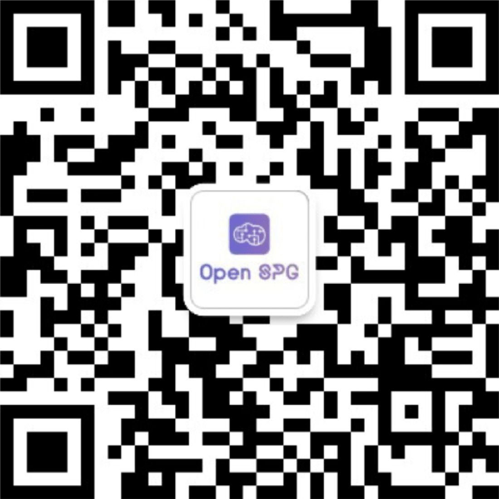

# 大模型知识服务框架 KAG

<div align="center">
<a href="https://spg.openkg.cn/en-US">

</a>
</div>

<p align="center">
  <a href="./README.md">English</a> |
  <a href="./README_cn.md">简体中文</a> |
  <a href="./README_ja.md">日本語版ドキュメント</a>
</p>

<p align="center">
    <a href='https://arxiv.org/pdf/2409.13731'></a>
    <a href="https://github.com/OpenSPG/KAG/releases/latest">
        
    </a>
    <a href="https://openspg.yuque.com/ndx6g9/docs">
        
    </a>
    <a href="https://github.com/OpenSPG/KAG/blob/main/LICENSE">
        
    </a>
</p>

# 1. KAG 是什么

KAG 是基于 [OpenSPG](https://github.com/OpenSPG/openspg) 引擎和大型语言模型的逻辑推理问答框架，用于构建垂直领域知识库的逻辑推理问答解决方案。KAG 可以有效克服传统 RAG 向量相似度计算的歧义性和 OpenIE 引入的 GraphRAG 的噪声问题。KAG 支持逻辑推理、多跳事实问答等，并且明显优于目前的 SOTA 方法。

KAG 的目标是在专业领域构建知识增强的 LLM 服务框架，支持逻辑推理、事实问答等。KAG 充分融合了 KG 的逻辑性和事实性特点，其核心功能包括：

* 知识与 Chunk 互索引结构，以整合更丰富的上下文文本信息
* 利用概念语义推理进行知识对齐，缓解 OpenIE 引入的噪音问题
* 支持 Schema-Constraint 知识构建，支持领域专家知识的表示与构建
* 逻辑符号引导的混合推理与检索，实现逻辑推理和多跳推理问答

⭐️点击右上角的 Star 关注 KAG，可以获取最新发布的实时通知！🌟


# 2. KAG 核心功能

## 2.1 LLM 友好的语义化知识管理

私域知识库场景，非结构化数据、结构化信息、业务专家经验 往往三者共存，KAG 提出了一种对大型语言模型（LLM）友好的知识表示框架，在 DIKW（数据、信息、知识和智慧）的层次结构基础上，将 SPG 升级为对 LLM 友好的版本，命名为 LLMFriSPG。

这使得它能够在同一知识类型（如实体类型、事件类型）上兼容无 schema 约束的信息提取和有 schema 约束的专业知识构建，并支持图结构与原始文本块之间的互索引表示。

这种互索引表示有助于基于图结构的倒排索引的构建，并促进了逻辑形式的统一表示、推理和检索。同时通过知识理解、语义对齐等进一步降低信息抽取的噪声，提升知识的准确率和一致性。


## 2.2 逻辑符号引导的混合推理引擎

KAG 提出了一种逻辑符号引导的混合求解和推理引擎。该引擎包括三种类型的运算符：规划、推理和检索，将自然语言问题转化为结合语言和符号的问题求解过程。

在这个过程中，每一步都可以利用不同的运算符，如精确匹配检索、文本检索、数值计算或语义推理，从而实现四种不同问题求解过程的集成：图谱推理、逻辑计算、Chunk 检索和 LLM 推理。


# 3. 版本发布

## 3.1 最近更新
* 2025.06.27 : 发布KAG 0.8.0 版本
  * 扩展了私域知识库（含结构化、非结构化数据）、公网知识库 两种模式，支持通过MCP 协议引入LBS、WebSearch 等公网数据源
  * 升级了私域知识库索引管理的能力，内置Outline、Summary、KnowledgeUnit、AtomicQuery、Chunk、Table 等多种基础索引类型
  * 将知识库和应用解耦，知识库管理私域数据（结构化 & 非结构化）、公网数据；应用可关联多知识库，基于知识库构建阶段的索引类型，自动适配对应的检索器完成数据召回
  * 全面拥抱MCP，提供在agent 流程中接入KAG 推理问答（基于MCP 协议）的能力
  * 完成了对KAG-Thinker 模型的适配。通过复杂问题的广度拆分和深度求解、知识边界判定、检索结果抗噪等优化，在多轮迭代式思考范式的牵引下，提升了KAG框架推理范式的稳定性，推理逻辑的严谨性
* 2025.04.17 : 发布KAG 0.7 版本
  * 我们对框架进行了全面重构。新增了对static和iterative两种任务规划模式的支持，同时实现了更严谨的推理阶段知识分层机制
  * 我们对产品体验进行了全面优化：在推理阶段新增"简易模式"和"深度推理"双模式，并支持流式推理输出、图索引自动渲染、生成内容关联原始文献等
  * KAG仓库的一级目录中新增open_benchmark目录，相同基座下对比各种RAG方法实现sota
  * 提供"轻量级构建"模式,知识构建token 成本降低89%
* 2025.01.07 : 支持 领域知识注入、领域 schema 自定义、摘要生成类任务支持、可视化图分析查询、schema-constraint模式抽取等
* 2024.11.21 : 支持 Word 文档上传、知识库删除、模型调用并发度设置、用户体验优化等
* 2024.10.25 : KAG 首次发布

## 3.2 后续计划

* 我们持续致力于持续提升大模型利用外部知识库的能力，实现大模型与符号知识的双向增强和有机融合，不断提升专业场景推理问答的事实性、严谨性和一致性等，我们也将持续发布，不断提升能力的上限，不断推进垂直领域的落地

# 4. 快速开始

## 4.1 基于产品（面向普通用户）

### 4.1.1 引擎&依赖 镜像安装

* **推荐系统版本：**

  ```text
  macOS 用户：macOS Monterey 12.6 或更新版本
  Linux 用户：CentOS 7 / Ubuntu 20.04 或更新版本
  Windows 用户：Windows 10 LTSC 2021 或更新版本
  ```

* **软件要求：**

  ```text
  macOS / Linux 用户：Docker，Docker Compose
  Windows 用户：WSL 2 / Hyper-V，Docker，Docker Compose
  ```

使用以下命令下载 docker-compose.yml 并用 Docker Compose 启动服务。

```bash
# 设置 HOME 环境变量（仅 Windows 用户需要执行）
# set HOME=%USERPROFILE%

curl -sSL https://raw.githubusercontent.com/OpenSPG/openspg/refs/heads/master/dev/release/docker-compose.yml -o docker-compose.yml
docker compose -f docker-compose.yml up -d
```

### 4.1.2 使用

浏览器打开 KAG 产品默认链接：<http://127.0.0.1:8887> 。
```text
Default Username: openspg
Default password: openspg@kag
```
具体使用请参考 [KAG使用(产品模式)](https://openspg.yuque.com/ndx6g9/docs/zxh5a5dr03945l1x#zZm7i)。

## 4.2 基于工具包（面向开发者）

### 4.2.1 引擎&依赖 镜像安装

参考 4.1 部分完成引擎&依赖的镜像安装。

### 4.2.2 KAG 安装

**macOS / Linux 开发者**

```text
# 安装 Python 虚拟环境：conda create -n kag-demo python=3.10 && conda activate kag-demo

# 代码 clone：git clone https://github.com/OpenSPG/KAG.git

# KAG 安装: cd KAG && pip install -e .
```

**Windows 开发者**

```
# 安装官方 Python 3.10 或更新版本，安装 Git。

# 创建、激活 Python 虚拟环境：py -m venv kag-demo && kag-demo\Scripts\activate

# 代码 clone：git clone https://github.com/OpenSPG/KAG.git

# KAG 安装: cd KAG && pip install -e .
```

### 4.2.3 使用

开发者可以参考 [KAG使用(开发者模式)](https://openspg.yuque.com/ndx6g9/docs/zxh5a5dr03945l1x#jWr0d)，基于 KAG 内置的各种组件，实现内置数据集的效果复现 + 新场景的落地。


# 5. 技术架构


KAG 框架包括 kg-builder、kg-solver、kag-model 三部分。本次发布只涉及前两部分，kag-model 将在后续逐步开源发布。

kg-builder 实现了一种对大型语言模型（LLM）友好的知识表示，在 DIKW（数据、信息、知识和智慧）的层次结构基础上，升级 SPG 知识表示能力，在同一知识类型（如实体类型、事件类型）上兼容无 schema 约束的信息提取和有 schema 约束的专业知识构建，并支持图结构与原始文本块之间的互索引表示，为推理问答阶段的高效检索提供支持。

kg-solver 采用逻辑形式引导的混合求解和推理引擎，该引擎包括三种类型的运算符：规划、推理和检索，将自然语言问题转化为结合语言和符号的问题求解过程。在这个过程中，每一步都可以利用不同的运算符，如精确匹配检索、文本检索、数值计算或语义推理，从而实现四种不同问题求解过程的集成：检索、知识图谱推理、语言推理和数值计算。

# 6. 联系我们

**GitHub**: <https://github.com/OpenSPG/KAG>

**官网**: <https://openspg.github.io/v2/docs_ch>



# 7. KAG 与 RAG、GraphRAG 差异

**KAG introduction and applications**: <https://github.com/orgs/OpenSPG/discussions/52>

# 8. 引用

如果您使用本软件，请以下面的方式引用：

* [KAG: Boosting LLMs in Professional Domains via Knowledge Augmented Generation](https://arxiv.org/abs/2409.13731)
* KGFabric: A Scalable Knowledge Graph Warehouse for Enterprise Data Interconnection

```bibtex
@article{liang2024kag,
  title={KAG: Boosting LLMs in Professional Domains via Knowledge Augmented Generation},
  author={Liang, Lei and Sun, Mengshu and Gui, Zhengke and Zhu, Zhongshu and Jiang, Zhouyu and Zhong, Ling and Zhao, Peilong and Bo, Zhongpu and Yang, Jin and others},
  journal={arXiv preprint arXiv:2409.13731},
  year={2024}
}

@article{yikgfabric,
  title={KGFabric: A Scalable Knowledge Graph Warehouse for Enterprise Data Interconnection},
  author={Yi, Peng and Liang, Lei and Da Zhang, Yong Chen and Zhu, Jinye and Liu, Xiangyu and Tang, Kun and Chen, Jialin and Lin, Hao and Qiu, Leijie and Zhou, Jun}
}
```

# 许可协议

[Apache License 2.0](LICENSE)

# KAG 核心团队
梁磊，孙梦姝，桂正科，朱仲书，江洲钰，钟玲，赵培龙，伯仲璞，阳进，熊怀东，袁琳，徐军，汪兆洋，张志强，张文，陈华钧，陈文光，周俊，王昊奋
