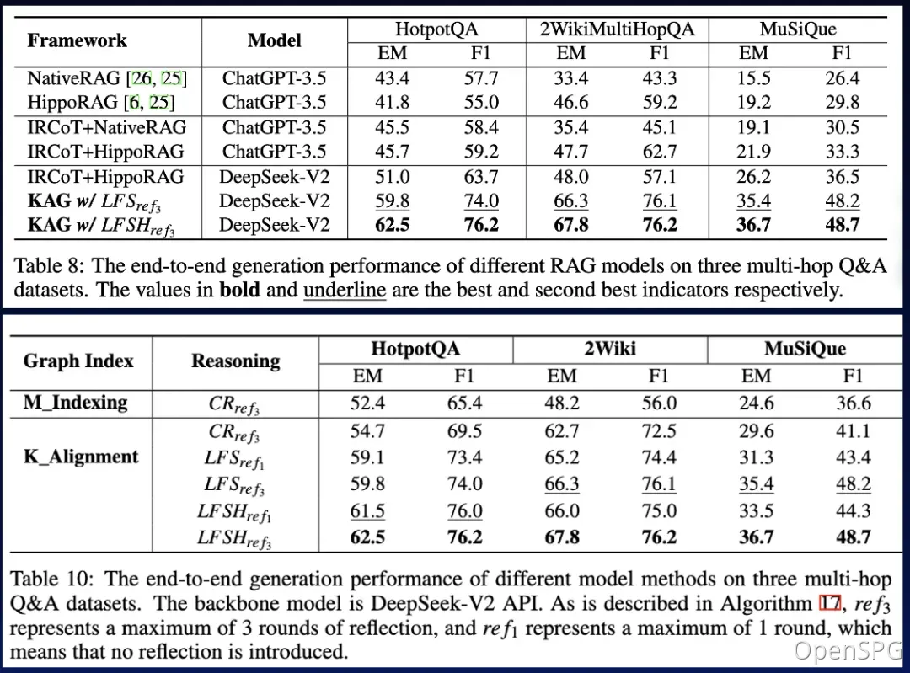
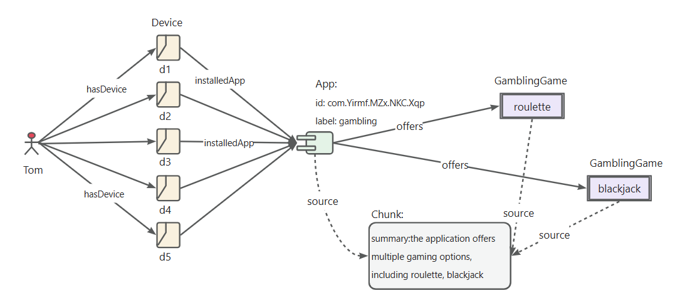
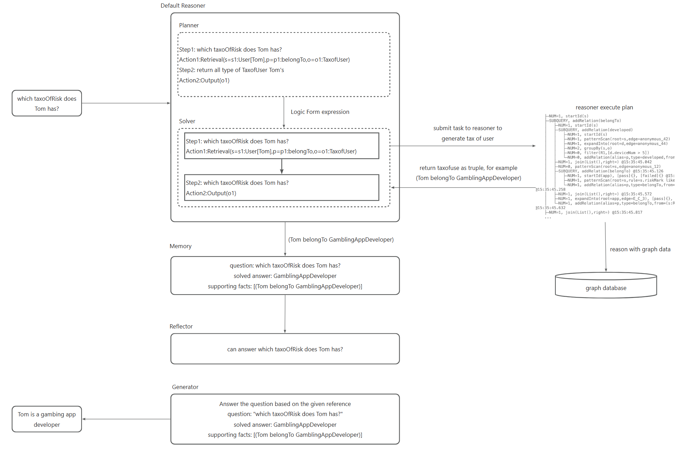
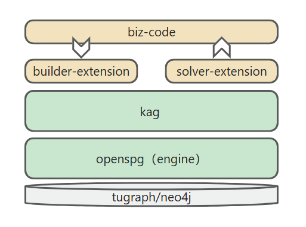

# KAG: 知識強化生成

[English version](./README.md)
[中文版文档](./README_cn.md)

## 1. KAGとは

検索強化生成（RAG）技術は、ドメインアプリケーションと大規模言語モデルの統合を促進します。しかし、RAGには、ベクトル類似性と知識推論の相関性のギャップが大きいことや、数値、時間関係、専門家のルールなどの知識ロジックに対して鈍感であるという問題があり、これが専門知識サービスの実装を妨げています。

2024年10月24日、OpenSPGはv0.5をリリースし、知識強化生成（KAG）の専門ドメイン知識サービスフレームワークを正式にリリースしました。KAGは、知識グラフとベクトル検索の利点を最大限に活用し、RAGの課題を解決するために、4つの側面から大規模言語モデルと知識グラフを双方向に強化することを目的としています：（1）LLMに優しい知識表現、（2）知識グラフと元のテキストフラグメントの相互インデックス、（3）論理形式に基づくハイブリッド推論エンジン、（4）意味推論との知識整合。

KAGは、NaiveRAG、HippoRAGなどの方法に比べて、マルチホップ質問応答タスクで顕著に優れています。hotpotQAでのF1スコアは19.6％相対的に向上し、2wikiでのF1スコアは33.5％相対的に向上しました。私たちは、KAGをAnt Groupの2つの専門知識質問応答タスク（電子政府質問応答と電子健康質問応答）に成功裏に適用し、RAG方法に比べて専門性が大幅に向上しました。

⭐️ リポジトリをスター登録して、エキサイティングな新機能やアップデートを最新の状態に保ちましょう！すべての新しいリリースに関する即時通知を受け取れます！🌟


### 1.1 技術アーキテクチャ


KAGフレームワークは、kg-builder、kg-solver、kag-modelの3つの部分で構成されています。このリリースでは最初の2つの部分のみが含まれており、kag-modelは今後段階的にオープンソースリリースされる予定です。

kg-builderは、大規模言語モデル（LLM）に優しい知識表現を実装しています。DIKW（データ、情報、知識、知恵）の階層構造に基づいて、SPGの知識表現能力を向上させ、同じ知識タイプ（例えば、エンティティタイプ、イベントタイプ）でスキーマ制約のない情報抽出とスキーマ制約のある専門知識構築の両方に対応し、グラフ構造と元のテキストブロックの相互インデックス表現をサポートし、推論質問応答段階の効率的な検索をサポートします。

kg-solverは、論理形式に基づくハイブリッド推論エンジンを使用しており、計画、推論、検索の3種類のオペレーターを含み、自然言語の問題を言語と記号を組み合わせた問題解決プロセスに変換します。このプロセスでは、各ステップで異なるオペレーター（例えば、正確な一致検索、テキスト検索、数値計算、または意味推論）を使用することができ、検索、知識グラフ推論、言語推論、数値計算の4つの異なる問題解決プロセスの統合を実現します。

### 1.2 知識表現

プライベートナレッジベースのコンテキストでは、非構造化データ、構造化情報、ビジネスエキスパートの経験が共存することがよくあります。KAGはDIKW階層を参照して、SPGをLLMに優しいバージョンにアップグレードします。ニュース、イベント、ログ、書籍などの非構造化データ、および取引、統計、承認などの構造化データ、ビジネス経験、ドメイン知識ルールに対して、KAGはレイアウト分析、知識抽出、プロパティ正規化、意味整合などの技術を使用して、元のビジネスデータと専門家のルールを統一されたビジネス知識グラフに統合します。


これにより、同じ知識タイプ（例えば、エンティティタイプ、イベントタイプ）でスキーマ制約のない情報抽出とスキーマ制約のある専門知識構築の両方に対応し、グラフ構造と元のテキストブロックの相互インデックス表現をサポートします。この相互インデックス表現は、グラフ構造に基づく逆インデックスの構築に役立ち、論理形式の統一表現と推論を促進します。

### 1.3 論理形式に基づくハイブリッド推論


KAGは、論理形式に基づくハイブリッド推論エンジンを提案しています。このエンジンは、計画、推論、検索の3種類のオペレーターを含み、自然言語の問題を言語と記号を組み合わせた問題解決プロセスに変換します。このプロセスでは、各ステップで異なるオペレーター（例えば、正確な一致検索、テキスト検索、数値計算、または意味推論）を使用することができ、検索、知識グラフ推論、言語推論、数値計算の4つの異なる問題解決プロセスの統合を実現します。

## 2. 効果はどうですか？

### 2.1 公開データセットの効果（マルチホップ推論）



最適化後、KAGの垂直分野での適応性を検証しただけでなく、一般的なデータセットのマルチホップ質問応答で既存のRAG方法と比較しました。その結果、SOTA方法よりも明らかに優れており、2wikiでのF1スコアが33.5％、hotpotQAでのF1スコアが19.6％向上しました。このフレームワークを引き続き最適化しており、エンドツーエンドの実験とアブレーション実験の指標を通じてその有効性を実証しています。論理記号駆動の推論と概念整合の手法により、このフレームワークの有効性を実証しました。

### 2.2 ドメイン知識シナリオの効果（リスクマイニング）

#### 2.2.1 専門家ルールの定義

* 「ギャンブルAPP」識別ルールの定義

  **define riskAppTaxo rule**

  ```text
  Define (s:App)-[p:belongTo]->(o:`TaxOfRiskApp`/`GamblingApp`) {
      Structure {
          (s)
      }
      Constraint {
          R1("risk label marked as gambling") s.riskMark like "%Gambling%"
    }
  }
  ```

* 「App開発者」識別ルールの定義

  **define app developper rule**

  ```text
  Define (s:Person)-[p:developed]->(o:App) {
      Structure {
          (s)-[:hasDevice]->(d:Device)-[:install]->(o)
      }
      Constraint {
          deviceNum = group(s,o).count(d)
          R1("device installed same app"): deviceNum > 5
      }
  }
  ```

* 「ギャンブルApp開発者」識別ルールの定義

  **define a RiskUser of gambling app rule**

  ```text
  Define (s:Person)-[p:belongTo]->(o:`TaxOfRiskUser`/`DeveloperOfGamblingApp`) {
      Structure {
          (s)-[:developed]->(app:`TaxOfRiskApp`/`GamblingApp`)
      }
      Constraint {
      }
  }
  ```

#### 2.2.2 ビジネスデータ



#### 2.2.3 推論プロセス



推論プロセスの重要なステップは次のとおりです。

* 自然言語の問題を実行可能な論理式に変換します。これはプロジェクトの概念モデリングに依存しており、ブラックプロダクトマイニングドキュメントを参照してください。

* 変換された論理式をOpenSPGリゾルバーに提出して実行し、ユーザーの分類結果を取得します。

* ユーザーの分類結果に基づいて回答を生成します。

OpenSPGの概念モデリングと組み合わせることで、KAGは自然言語変換グラフクエリの難易度を下げ、データ指向の変換を分類概念指向の変換に変え、元のOpenSPGプロジェクトで自然言語質問応答の分野アプリケーションを迅速に実現できます。

## 3. どうやって使うの？

### 3.1 製品ベース（一般ユーザー向け）

#### 3.1.1 エンジン＆依存関係のイメージインストール

* **推奨システムバージョン：**

  ```text
  macOSユーザー：macOS Monterey 12.6以降
  Linuxユーザー：CentOS 7 / Ubuntu 20.04以降
  Windowsユーザー：Windows 10 LTSC 2021以降
  ```

* **ソフトウェア要件：**

  ```text
  macOS / Linuxユーザー：Docker、Docker Compose
  Windowsユーザー：WSL 2 / Hyper-V、Docker、Docker Compose
  ```

以下のコマンドを使用してdocker-compose.ymlファイルをダウンロードし、Docker Composeでサービスを起動します。

```bash
# HOME環境変数を設定（Windowsユーザーのみ実行が必要）
# set HOME=%USERPROFILE%

curl -sSL https://raw.githubusercontent.com/OpenSPG/openspg/refs/heads/master/dev/release/docker-compose.yml -o docker-compose.yml
docker compose -f docker-compose.yml up -d
```

#### 3.1.2 製品の使用

ブラウザでKAG製品のデフォルトURLを開きます：<http://127.0.0.1:8887>

詳細な紹介については、[製品使用](https://openspg.yuque.com/ndx6g9/cwh47i/rs7gr8g4s538b1n7#rtOlA)ガイドを参照してください。

### 3.2 ツールキットベース（開発者向け）

#### 3.2.1 エンジン＆依存関係のイメージインストール

3.1セクションを参照して、エンジン＆依存関係のイメージインストールを完了します。

#### 3.2.2 KAGのインストール

**macOS / Linux開発者**

```text
# conda環境の作成：conda create -n kag-demo python=3.10 && conda activate kag-demo

# コードのクローン：git clone https://github.com/OpenSPG/KAG.git

# KAGのインストール: cd KAG && pip install -e .
```

**Windows開発者**

```text
# 公式のPython 3.10以降をインストールし、Gitをインストールします。

# Python仮想環境の作成とアクティベート：py -m venv kag-demo && kag-demo\Scripts\activate

# コードのクローン：git clone https://github.com/OpenSPG/KAG.git

# KAGのインストール: cd KAG && pip install -e .
```

#### 3.2.3 ツールキットの使用

詳細な紹介については、[クイックスタート](https://openspg.yuque.com/ndx6g9/cwh47i/rs7gr8g4s538b1n7#cikso)ガイドを参照してください。その後、組み込みのコンポーネントを使用して、組み込みデータセットのパフォーマンス結果を再現し、新しいビジネスシナリオにこれらのコンポーネントを適用できます。

## 4. どのように拡張するの？

### 4.1 KAGの能力を拡張する

KAGが提供する組み込みコンポーネントが要件を満たさない場合、開発者はkag-builderおよびkag-solverの実装を独自に拡張できます。[KAG-Builder拡張](https://openspg.yuque.com/ndx6g9/cwh47i/ephl8hgth3gcgucn)および[KAG-Solver拡張](https://openspg.yuque.com/ndx6g9/cwh47i/rqdwk204izit2hsm)を参照してください。

#### 4.1.1 kag-builder拡張


KAGは、BuilderChainを使用して、リーダー、スプリッター、マッピング、エクストラクター、アライナー、ベクトライザーなどのコンポーネントを連結します。開発者は、kagが事前定義したBuilderChainを使用してグラフ構築を完了することも、事前定義されたコンポーネントを組み合わせてBuilderChainを取得することもできます。

同時に、開発者はビルダー内のコンポーネントをカスタマイズし、BuilderChainに埋め込んで実行することができます。

```text
kag
├──interface
│  ├── builder
│  │   ├── aligner_abc.py
│  │   ├── extractor_abc.py
│  │   ├── mapping_abc.py
│  │   ├── reader_abc.py
│  │   ├── splitter_abc.py
│  │   ├── vectorizer_abc.py
│  │   └── writer_abc.py
```

#### 4.1.2 kag-solver拡張

kag-solverは、リゾルバー、ジェネレーター、リフレクターコンポーネントで構成されるsolver-pipelineを実行します。KAGはデフォルトのリゾルバー、ジェネレーター、リフレクターを提供します。開発者は、次のAPIに基づいてカスタム実装を提供することもできます。

```text
kag
├── solver
│   ├── logic
│   │   └── solver_pipeline.py
├── interface
    ├── retriever
    │   ├── chunk_retriever_abc.py
    │   └── kg_retriever_abc.py
    └── solver
        ├── kag_generator_abc.py
        ├── kag_memory_abc.py
        ├── kag_reasoner_abc.py
        ├── kag_reflector_abc.py
        └── lf_planner_abc.py
```

### 4.2 KAGをカスタムモデルに適応させる

#### 4.2.1 生成モデルの適応

KAGは、Qwen / DeepSeek / GPTなどのOpenAIサービスと互換性のあるMaaS APIとの接続をサポートし、vLLM / Ollamaによってデプロイされたローカルモデルとの接続もサポートします。開発者は、llm_clientインターフェースに基づいてカスタムモデルサービスのサポートを追加できます。

```text
kag
├── common
  ├── llm
    ├── client
    │   ├── llm_client.py
    │   ├── ollama_client.py
    │   ├── openai_client.py
    │   ├── vllm_client.py
```

#### 4.2.2 表示モデルの適応

KAGは、OpenAIの表示モデルなどの呼び出しをサポートしており、OpenAIの埋め込みサービス、Ollamaによってデプロイされたbge-m3モデルを含みます。また、ローカルの埋め込みモデルのロードと使用もサポートしています。

```text
kag
├── common
  ├── vectorizer
  │   ├── vectorizer.py
  │   ├── openai_vectorizer.py
  │   ├── local_bge_m3_vectorizer.py
  │   ├── local_bge_vectorizer.py
```

### 4.3 KAGを他のフレームワークと統合する

他のフレームワークと統合する際には、外部のビジネスデータと専門知識を入力として使用し、kag-builderパイプラインを呼び出して知識グラフの構築を完了します。また、kag-solverを呼び出してQ&A推論プロセスを完了し、推論結果と中間プロセスをビジネスシステムに公開します。

他のフレームワークがkagを統合する方法は、次のように簡単に説明できます。



## 5. 今後の計画

* ドメイン知識の注入、ドメイン概念グラフとエンティティグラフの融合を実現

* kag-modelの最適化、KG構築とQ&Aの効率向上

* 知識ロジック制約の幻覚抑制

## 6. お問い合わせ

**GitHub**: <https://github.com/OpenSPG/KAG>

**OpenSPG**: <https://spg.openkg.cn/>


# 引用

このソフトウェアを使用する場合は、以下の方法で引用してください：

* [KAG: Boosting LLMs in Professional Domains via Knowledge Augmented Generation](https://arxiv.org/abs/2409.13731)

* KGFabric: A Scalable Knowledge Graph Warehouse for Enterprise Data Interconnection

```bibtex
@article{liang2024kag,
  title={KAG: Boosting LLMs in Professional Domains via Knowledge Augmented Generation},
  author={Liang, Lei and Sun, Mengshu and Gui, Zhengke and Zhu, Zhongshu and Jiang, Zhouyu and Zhong, Ling and Zhao, Peilong and Bo, Zhongpu and Yang, Jin and others},
  journal={arXiv preprint arXiv:2409.13731},
  year={2024}
}

@article{yikgfabric,
  title={KGFabric: A Scalable Knowledge Graph Warehouse for Enterprise Data Interconnection},
  author={Yi, Peng and Liang, Lei and Da Zhang, Yong Chen and Zhu, Jinye and Liu, Xiangyu and Tang, Kun and Chen, Jialin and Lin, Hao and Qiu, Leijie and Zhou, Jun}
}
```

# ライセンス

[Apache License 2.0](LICENSE)

# KAG Core Team
Lei Liang, Mengshu Sun, Zhengke Gui, Zhongshu Zhu, Zhouyu Jiang, Ling Zhong, Peilong Zhao, Zhongpu Bo, Jin Yang, Huaidong Xiong, Lin Yuan, Jun Xu, Zaoyang Wang, Zhiqiang Zhang, Wen Zhang, Huajun Chen, Wenguang Chen, Jun Zhou, Haofen Wang
