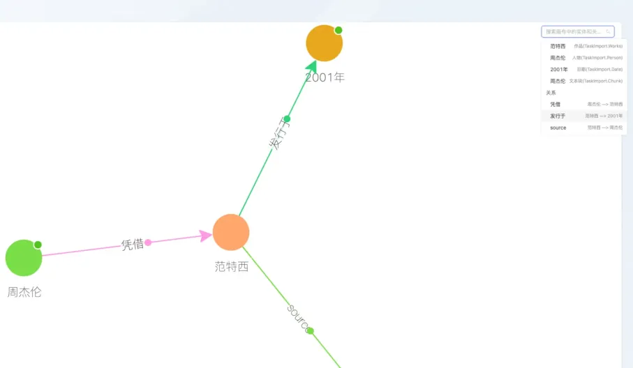

# KAG Examples

[English](./README.md) |
[简体中文](./README_cn.md)

## 1. Precondition

Please refer to [Quick Start](https://openspg.yuque.com/ndx6g9/cwh47i/rs7gr8g4s538b1n7) to install KAG and its dependency OpenSPG server, and learn about using KAG in developer mode.

## 2. Create a knowledge base

### 2.1 Create the project

#### Step 1: Enter the examples directory

```bash
cd kag/examples
```

#### Step 2: Edit project configuration

```bash
vim ./example_config.yaml
```

```yaml
#------------project configuration start----------------#
openie_llm: &openie_llm
  api_key: key
  base_url: https://api.deepseek.com
  model: deepseek-chat
  type: maas

chat_llm: &chat_llm
  api_key: key
  base_url: https://api.deepseek.com
  model: deepseek-chat
  type: maas

vectorize_model: &vectorize_model
  api_key: key
  base_url: https://api.siliconflow.cn/v1/
  model: BAAI/bge-m3
  type: openai
  vector_dimensions: 1024
vectorizer: *vectorize_model

log:
  level: INFO

project:
  biz_scene: default
  host_addr: http://127.0.0.1:8887
  id: "1"
  language: en
  namespace: TwoWikiTest
#------------project configuration end----------------#

#------------kag-builder configuration start----------------#
kag_builder_pipeline:
  chain:
    type: unstructured_builder_chain # kag.builder.default_chain.DefaultUnstructuredBuilderChain
    extractor:
      type: schema_free_extractor # kag.builder.component.extractor.schema_free_extractor.SchemaFreeExtractor
      llm: *openie_llm
      ner_prompt:
        type: default_ner # kag.builder.prompt.default.ner.OpenIENERPrompt
      std_prompt:
        type: default_std # kag.builder.prompt.default.std.OpenIEEntitystandardizationdPrompt
      triple_prompt:
        type: default_triple # kag.builder.prompt.default.triple.OpenIETriplePrompt
    reader:
      type: dict_reader # kag.builder.component.reader.dict_reader.DictReader
    post_processor:
      type: kag_post_processor # kag.builder.component.postprocessor.kag_postprocessor.KAGPostProcessor
      similarity_threshold: 0.9
    splitter:
      type: length_splitter # kag.builder.component.splitter.length_splitter.LengthSplitter
      split_length: 100000
      window_length: 0
    vectorizer:
      type: batch_vectorizer # kag.builder.component.vectorizer.batch_vectorizer.BatchVectorizer
      vectorize_model: *vectorize_model
    writer:
      type: kg_writer # kag.builder.component.writer.kg_writer.KGWriter
  num_threads_per_chain: 1
  num_chains: 16
  scanner:
    type: 2wiki_dataset_scanner # kag.builder.component.scanner.dataset_scanner.MusiqueCorpusScanner
#------------kag-builder configuration end----------------#

#------------kag-solver configuration start----------------#
search_api: &search_api
  type: openspg_search_api #kag.solver.tools.search_api.impl.openspg_search_api.OpenSPGSearchAPI

graph_api: &graph_api
  type: openspg_graph_api #kag.solver.tools.graph_api.impl.openspg_graph_api.OpenSPGGraphApi

exact_kg_retriever: &exact_kg_retriever
  type: default_exact_kg_retriever # kag.solver.retriever.impl.default_exact_kg_retriever.DefaultExactKgRetriever
  el_num: 5
  llm_client: *chat_llm
  search_api: *search_api
  graph_api: *graph_api

fuzzy_kg_retriever: &fuzzy_kg_retriever
  type: default_fuzzy_kg_retriever # kag.solver.retriever.impl.default_fuzzy_kg_retriever.DefaultFuzzyKgRetriever
  el_num: 5
  vectorize_model: *vectorize_model
  llm_client: *chat_llm
  search_api: *search_api
  graph_api: *graph_api

chunk_retriever: &chunk_retriever
  type: default_chunk_retriever # kag.solver.retriever.impl.default_fuzzy_kg_retriever.DefaultFuzzyKgRetriever
  llm_client: *chat_llm
  recall_num: 10
  rerank_topk: 10

kag_solver_pipeline:
  memory:
    type: default_memory # kag.solver.implementation.default_memory.DefaultMemory
    llm_client: *chat_llm
  max_iterations: 3
  reasoner:
    type: default_reasoner # kag.solver.implementation.default_reasoner.DefaultReasoner
    llm_client: *chat_llm
    lf_planner:
      type: default_lf_planner # kag.solver.plan.default_lf_planner.DefaultLFPlanner
      llm_client: *chat_llm
      vectorize_model: *vectorize_model
    lf_executor:
      type: default_lf_executor # kag.solver.execute.default_lf_executor.DefaultLFExecutor
      llm_client: *chat_llm
      force_chunk_retriever: true
      exact_kg_retriever: *exact_kg_retriever
      fuzzy_kg_retriever: *fuzzy_kg_retriever
      chunk_retriever: *chunk_retriever
      merger:
        type: default_lf_sub_query_res_merger # kag.solver.execute.default_sub_query_merger.DefaultLFSubQueryResMerger
        vectorize_model: *vectorize_model
        chunk_retriever: *chunk_retriever
  generator:
    type: default_generator # kag.solver.implementation.default_generator.DefaultGenerator
    llm_client: *chat_llm
    generate_prompt:
      type: resp_simple # kag/examples/2wiki/solver/prompt/resp_generator.py
  reflector:
    type: default_reflector # kag.solver.implementation.default_reflector.DefaultReflector
    llm_client: *chat_llm

#------------kag-solver configuration end----------------#
```

Update the generative model configurations ``openie_llm`` and ``chat_llm`` and the representive model configuration ``vectorizer_model`` in the configuration file.

You need to fill in correct ``api_key``s. If your model providers and model names are different from the default values, you also need to update ``base_url`` and ``model``.

#### Step 3: Create the project (i.e. knowledge base in product mode)

```bash
knext project create --config_path ./example_config.yaml
```

#### Step 4: Initial contents of the directory

After creating the project, a directory with the same name as the ``namespace`` field in the ``project`` configuration (e.g., ``TwoWikiTest`` in this example) will be created under the ``kag/examples`` directory, and the KAG framework project code will be initialized.

Users can modify one or more of the following files to complete the customization of business-specific knowledge graph construction and reasoning-based question answering.

```text
.
├── builder
│   ├── __init__.py
│   ├── data
│   │   └── __init__.py
│   ├── indexer.py
│   └── prompt
│       └── __init__.py
├── kag_config.yaml
├── reasoner
│   └── __init__.py
├── schema
│   ├── TwoWikiTest.schema
│   └── __init__.py
└── solver
    ├── __init__.py
    ├── data
    │   └── __init__.py
    └── prompt
        └── __init__.py
```

### 2.2 Update the project (Optional)

If there are configuration changes, you can refer to this section to update the configuration information to the server.

#### Step 1: Enter the project directory

```bash
cd kag/examples/TwoWikiTest
```

#### Step 2: Edit project configuration

**Note**: The embedding vectors generated by different representation models can vary significantly. It is recommended not to update the ``vectorizer_model`` configuration after the project is created. If you need to update the ``vectorizer_model`` configuration, please create a new project.

```bash
vim ./kag_config.yaml
```

#### Step 3: Run the update command

After editing the project configuration, use the ``knext project update`` command to update the local configuration information to the OpenSPG server.

```bash
knext project update --proj_path .
```

## 3. Import documents

#### Step 1: Enter the project directory

```bash
cd kag/examples/TwoWikiTest
```

### Step 2: Retrieve corpus data

The test corpus data for the 2wiki dataset is located at ``kag/examples/2wiki/builder/data/2wiki_corpus.json``, containing 6,119 documents and 1,000 question-answer pairs. To quickly complete the entire process, there is also a ``2wiki_corpus_sub.json`` file in the same directory, which contains only 7 documents. We will use this smaller dataset as an example for the experiment.

Copy it to the directory with the same name as the ``TwoWikiTest`` project:

```bash
cp ../2wiki/builder/data/2wiki_sub_corpus.json builder/data
```

### Step 3: Edit the schema (Optional)

Edit the schema file ``schema/TwoWikiTest.schema``. For an introduction of OpenSPG schema, please refer to [Declarative Schema](https://openspg.yuque.com/ndx6g9/cwh47i/fiq6zum3qtzr7cne).

### Step 4: Commit the schema to OpenSPG server

```bash
knext schema commit
```

### Step 5: Execute the build task

Define the build task in the file ``builder/indexer.py``:

```python
import os
import logging
from kag.common.registry import import_modules_from_path

from kag.builder.runner import BuilderChainRunner

logger = logging.getLogger(__name__)


def buildKB(file_path):
    from kag.common.conf import KAG_CONFIG

    runner = BuilderChainRunner.from_config(
        KAG_CONFIG.all_config["kag_builder_pipeline"]
    )
    runner.invoke(file_path)

    logger.info(f"\n\nbuildKB successfully for {file_path}\n\n")


if __name__ == "__main__":
    import_modules_from_path(".")
    dir_path = os.path.dirname(__file__)
    # Set file_path to the path of the corpus file prepared earlier
    file_path = os.path.join(dir_path, "data/2wiki_sub_corpus.json")

    buildKB(file_path)
```

Run the ``indexer.py`` script to complete the knowledge graph construction for unstructured data.

```bash
cd builder
python indexer.py
```

After the build script is started, a checkpoint directory for the task will be generated in the current working directory, recording the checkpoints and statistical information of the build process.

```text
ckpt
├── chain
├── extractor
├── kag_checkpoint_0_1.ckpt
├── postprocessor
├── reader
└── splitter
```

You can view the extraction task statistics, such as how many nodes/edges were extracted from each document, using the following command:

```bash
less ckpt/kag_checkpoint_0_1.ckpt
```

To see how many document entries were successfully written to the graph database, use the following command:

```bash
wc -l ckpt/kag_checkpoint_0_1.ckpt
```

The KAG framework provides checkpoint-based resumption functionality. If the task is interrupted due to a program error or other external factors (e.g., insufficient LLM invocation credits), you can rerun ``indexer.py``. KAG will automatically load the checkpoint file and reuse the existing results.

### Step 6: Inspect the constructed knowledge graph

Currently, OpenSPG-KAG provides the [Knowledge Exploration](https://openspg.yuque.com/ndx6g9/cwh47i/mzq74eaynm4rqx4b) capability in product mode, along with the corresponding API documentation [HTTP API Reference](https://openspg.yuque.com/ndx6g9/cwh47i/qvbgge62p7argtd2).



## 4. Reasoning-based question answering

#### Step 1: Enter the project directory

```bash
cd kag/examples/TwoWikiTest
```

### Step 2: Retrieve QA data

The question-answer data corresponding to the ``2wiki_sub_corpus.json`` dataset is located at ``kag/examples/2wiki/solver/data/2wiki_qa_sub.json``, containing two question-answer pairs. Copy it to the directory with the same name as the ``TwoWikiTest`` project.

```bash
cp ../2wiki/solver/data/2wiki_qa_sub.json solver/data
```

### Step 3: Edit the QA script

```bash
vim ./solver/qa.py
```

Paste the following content into ``qa.py`` (or you can directly copy the question-answer script from the built-in 2wiki project).

```python
import json
import logging
import os
import time
from concurrent.futures import ThreadPoolExecutor, as_completed

from tqdm import tqdm

from kag.common.benchmarks.evaluate import Evaluate
from kag.solver.logic.solver_pipeline import SolverPipeline
from kag.common.conf import KAG_CONFIG
from kag.common.registry import import_modules_from_path

from kag.common.checkpointer import CheckpointerManager

logger = logging.getLogger(__name__)


class EvaFor2wiki:
    """
    init for kag client
    """

    def __init__(self):
        pass

    """
        qa from knowledge base, 
    """

    def qa(self, query):
        resp = SolverPipeline.from_config(KAG_CONFIG.all_config["kag_solver_pipeline"])
        answer, traceLog = resp.run(query)

        logger.info(f"\n\nso the answer for '{query}' is: {answer}\n\n")
        return answer, traceLog

    """
        parallel qa from knowledge base
        and getBenchmarks(em, f1, answer_similarity)
    """

    def parallelQaAndEvaluate(
        self, qaFilePath, resFilePath, threadNum=1, upperLimit=10
    ):
        ckpt = CheckpointerManager.get_checkpointer(
            {"type": "zodb", "ckpt_dir": "ckpt"}
        )

        def process_sample(data):
            try:
                sample_idx, sample = data
                sample_id = sample["_id"]
                question = sample["question"]
                gold = sample["answer"]
                if question in ckpt:
                    print(f"found existing answer to question: {question}")
                    prediction, traceLog = ckpt.read_from_ckpt(question)
                else:
                    prediction, traceLog = self.qa(question)
                    ckpt.write_to_ckpt(question, (prediction, traceLog))

                evalObj = Evaluate()
                metrics = evalObj.getBenchMark([prediction], [gold])
                return sample_idx, sample_id, prediction, metrics, traceLog
            except Exception as e:
                import traceback

                logger.warning(
                    f"process sample failed with error:{traceback.print_exc()}\nfor: {data}"
                )
                return None

        qaList = json.load(open(qaFilePath, "r"))
        total_metrics = {
            "em": 0.0,
            "f1": 0.0,
            "answer_similarity": 0.0,
            "processNum": 0,
        }
        with ThreadPoolExecutor(max_workers=threadNum) as executor:
            futures = [
                executor.submit(process_sample, (sample_idx, sample))
                for sample_idx, sample in enumerate(qaList[:upperLimit])
            ]
            for future in tqdm(
                as_completed(futures),
                total=len(futures),
                desc="parallelQaAndEvaluate completing: ",
            ):
                result = future.result()
                if result is not None:
                    sample_idx, sample_id, prediction, metrics, traceLog = result
                    sample = qaList[sample_idx]

                    sample["prediction"] = prediction
                    sample["traceLog"] = traceLog
                    sample["em"] = str(metrics["em"])
                    sample["f1"] = str(metrics["f1"])

                    total_metrics["em"] += metrics["em"]
                    total_metrics["f1"] += metrics["f1"]
                    total_metrics["answer_similarity"] += metrics["answer_similarity"]
                    total_metrics["processNum"] += 1

                    if sample_idx % 50 == 0:
                        with open(resFilePath, "w") as f:
                            json.dump(qaList, f)

        with open(resFilePath, "w") as f:
            json.dump(qaList, f)

        res_metrics = {}
        for item_key, item_value in total_metrics.items():
            if item_key != "processNum":
                res_metrics[item_key] = item_value / total_metrics["processNum"]
            else:
                res_metrics[item_key] = total_metrics["processNum"]
        CheckpointerManager.close()
        return res_metrics


if __name__ == "__main__":
    import_modules_from_path("./prompt")
    evalObj = EvaFor2wiki()

    start_time = time.time()
    filePath = "./data/2wiki_qa_sub.json"

    evalObj.qa("When did Lothair Ii's mother die?")

    qaFilePath = os.path.join(os.path.abspath(os.path.dirname(__file__)), filePath)
    resFilePath = os.path.join(
        os.path.abspath(os.path.dirname(__file__)), f"2wikitest_res_{start_time}.json"
    )
    total_metrics = evalObj.parallelQaAndEvaluate(
        qaFilePath, resFilePath, threadNum=20, upperLimit=10000
    )

    total_metrics["cost"] = time.time() - start_time
    with open(f"./2wikitest_metrics_{start_time}.json", "w") as f:
        json.dump(total_metrics, f)
    print(total_metrics)
```

### Step 4: Copy the answer generation prompt

Copy the answer generation prompt from the built-in 2wiki project.

```bash
cp ../2wiki/solver/prompt/resp_generator.py solver/prompt
```

### Step 5: Execute the QA task

```bash
cd solver
python qa.py
```

After execution, the QA performance metrics will be printed.

## 5. Other built-in examples

You can enter the [kag/examples](.) directory to explore the built-in examples provided in the source code of KAG.

* [musique](./musique/README.md) (Multi-hop Q&A)
* [twowiki](./2wiki/README.md) (Multi-hop Q&A)
* [hotpotqa](./hotpotqa/README.md) (Multi-hop Q&A)
* [Risk Mining Knowledge Graph](./riskmining/README.md)
* [Enterprise Supply Chain Knowledge Graph](./supplychain/README.md)
* [Medical Knowledge Graph](./medicine/README.md)

