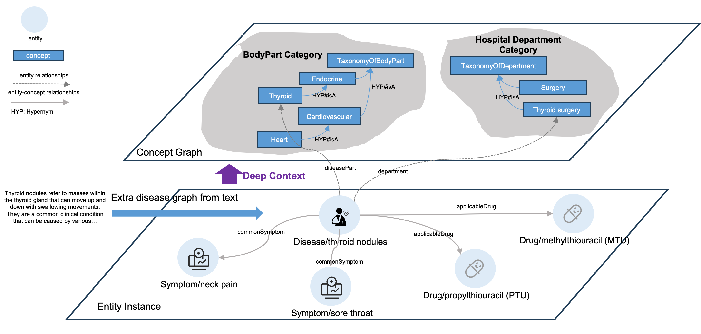

# KAG Example: Medicine

This example demonstrates the application of KAG in the medical domain.

It leaverages LLMs to extract and construct entities and relationships
into a knowledge graph with a schema-free extractor. It also leaverages
the schema definitions to import data and domain knowledge into the
knowledge graph in a schema-constrained style.



## Steps to reproduce

1. Follow the Quick Start guide of KAG to install the OpenSPG server and KAG.

   The following steps assume the Python virtual environment with KAG installed
   is activated and the current directory is [medicine](.).

2. Update the ``openie_llm``, ``chat_llm`` and ``vectorizer_model`` configurations
   in [kag_config.yaml](./kag_config.yaml) properly.

3. Restore the KAG project.

   ```bash
   knext project restore --host_addr http://127.0.0.1:8887 --proj_path .
   ```

4. Commit the schema.

   ```bash
   knext schema commit
   ```

5. Execute [indexer.py](./builder/indexer.py) in the [builder](./builder) directory to build the knowledge graph
   with domain knowledge importing and schema-free extraction.

   ```bash
   cd builder && python indexer.py && cd ..
   ```

   Check [Disease.csv](./builder/data/Disease.csv) to inspect the descriptions of diseases.
   Those unstructured descriptions are schema-free extracted by ``extract_runner``
   defined in [kag_config.yaml](./kag_config.yaml).

   Other structured data in [data](./builder/data) will be imported directly by corresponding
   builder chains defined in [kag_config.yaml](./kag_config.yaml).

6. You can use the ``knext reasoner`` command to inspect the built knowledge graph.

   The query DSL will be executed by the OpenSPG server, which supports ISO GQL.

   * Execute the following command to execute DSL directly.

     ```bash
     knext reasoner execute --dsl "
     MATCH
         (s:Medicine.HospitalDepartment)-[p]->(o)
     RETURN
         s.id, s.name
     "
     ```

     The results will be displayed on the screen and saved as CSV to the current directory.

   * You can also save the DSL to a file and execute the file.

     ```bash
     knext reasoner execute --file ./reasoner/rule.dsl
     ```

   * You can also use the reasoner Python client to query the knowledge graph.

     ```bash
     python ./reasoner/client.py
     ```

7. Execute [evaForMedicine.py](./solver/evaForMedicine.py) in the [solver](./solver) directory
   to ask a demo question and view the answer and trace log.

   ```bash
   cd solver && python evaForMedicine.py && cd ..
   ```

8. (Optional) To delete the checkpoint, execute the following command.

   ```bash
   rm -rf ./builder/ckpt
   ```

   To delete the KAG project and related knowledge graph, execute the following similar command.
   Replace the OpenSPG server address and KAG project id with actual values.

   ```bash
   curl http://127.0.0.1:8887/project/api/delete?projectId=1
   ```
