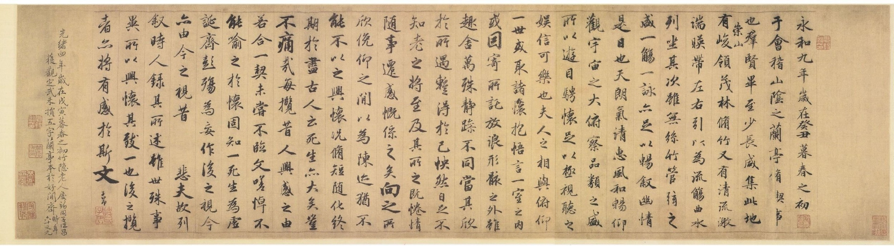
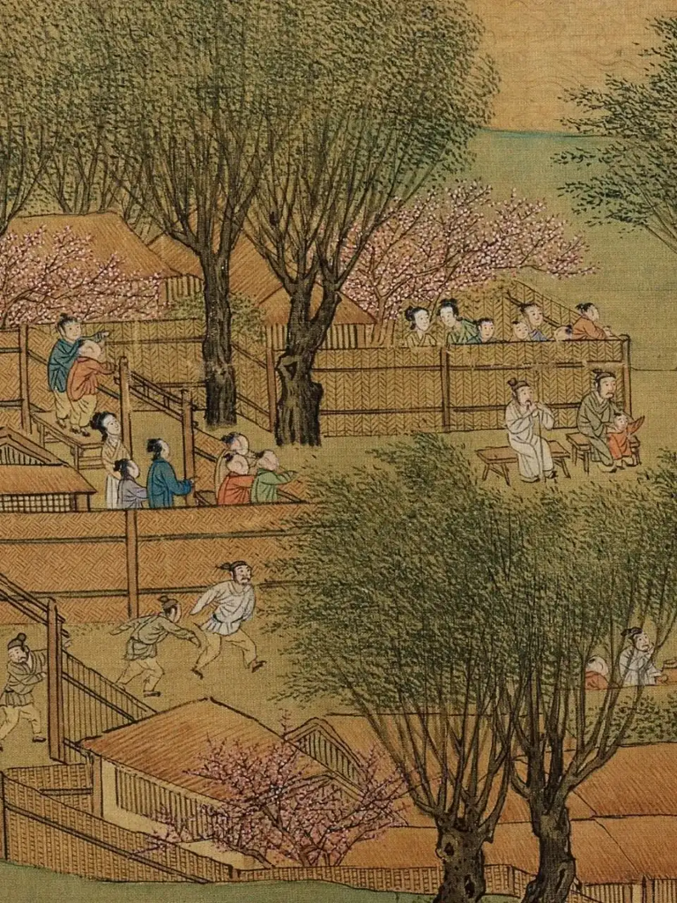
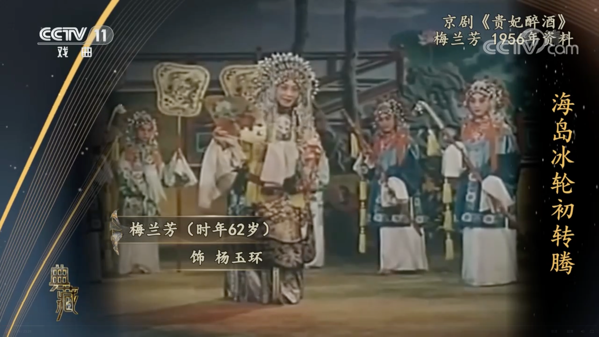

# 中国传统文化艺术的魅力

## 引言
中国传统文化艺术承载了数千年的历史积淀，是中华民族智慧和审美的结晶。从书法到绘画，从戏剧到舞蹈，这些艺术形式不仅展现了中国人民的创造力，更成为连接传统与现代的重要纽带。

## 书法的魅力
书法是中国传统艺术的重要组成部分，以独特的笔法和线条传递情感与思想。

- **起源**：可以追溯至甲骨文和钟鼎文。
- **特点**：
    - 强调线条的流动性和力度。
    - 分为篆书、隶书、楷书、草书、行书等不同字体。
- **代表人物**：王羲之、颜真卿、怀素。

---

## 国画的魅力
国画以山水、花鸟和人物为题材，通过水墨表现形式传递自然之美。

- **起源**：春秋战国时期的壁画。
- **特点**：
    - 注重意境，通过留白表达虚实之感。
    - 使用墨和色彩的层次变化创造深度。
- **代表人物**：张择端、唐寅、齐白石。

---

## 中国戏剧的魅力
中国戏剧以多样的表现形式展现了历史故事与民间传说，是融合音乐、舞蹈和表演的综合艺术。

- **主要形式**：
    - 京剧：被誉为中国国粹。
    - 昆曲：最古老的戏曲剧种之一。
    - 黄梅戏：因轻柔、婉转的唱腔而闻名。
- **特点**：
    - 以唱念做打结合，通过服饰与动作展现角色性格。
- **代表人物**：梅兰芳、程砚秋。

---

## 中国传统艺术的特点与代表

| 艺术形式   | 起源时代     | 主要特点                                           | 代表人物       |
|------------|--------------|---------------------------------------------------|----------------|
| **书法**   | 商周         | 强调线条力度与流动性，字体多样化                   | 王羲之、颜真卿  |
| **国画**   | 春秋战国     | 注重意境留白，表现山水、花鸟及人物等题材           | 张择端、齐白石  |
| **戏剧**   | 秦汉         | 综合表演艺术，融合唱念做打，服饰与动作讲究         | 梅兰芳、程砚秋  |
| **陶瓷**   | 商代         | 釉色精美，造型独特，代表青花瓷与汝窑               | 无具体个人      |

---

## 传统文化艺术的国际影响
### 传播的途径与方式
- 中国传统文化艺术通过多种途径走向世界，如文化交流活动、国际艺术展览、影视作品传播等。
- 中国艺术家在国际舞台上展示中国传统文化艺术的魅力，吸引了众多国际友人的关注。
### 传播的成果与影响
- 中国绘画、书法、戏曲等艺术形式在国际上受到了广泛赞誉，许多外国艺术爱好者学习和研究中国传统文化艺术。
- 中国传统文化艺术的传播促进了中外文化交流与合作，增进了不同国家和民族之间的相互理解和友谊。
### 传播的挑战与机遇
- 中国传统文化艺术在国际传播中面临着文化差异、语言障碍等挑战。
- 但随着中国文化的影响力不断提升，国际社会对中国传统文化艺术的兴趣也在不断增长，为传播提供了新的机遇。
## 中国传统文化艺术对世界文化的贡献
### 艺术风格与审美观念的影响
- 中国传统文化艺术的独特风格和审美观念对世界艺术产生了深远影响，如中国绘画的写意风格、书法的线条美学等。
- 许多西方艺术家从中国传统文化艺术中汲取灵感，创作出具有东方韵味的作品。
### 文化交流与融合的促进
- 中国传统文化艺术的传播促进了世界文化的交流与融合，推动了不同文化之间的相互借鉴和共同发展。
- 通过文化交流活动，各国文化在相互碰撞中不断丰富和发展，形成了多元共生的文化格局。
### 人类文明进步的推动
- 中国传统文化艺术作为人类文明的重要组成部分，为人类文明的进步做出了重要贡献。
- 它所蕴含的智慧和精神价值，为解决人类面临的共同问题提供了有益的启示。

## 传统文化艺术的未来展望
### 与现代科技的深度融合
- 随着科技的不断进步，传统文化艺术将与现代科技深度融合，创造出更多新颖独特的艺术形式和作品。
- 虚拟现实、增强现实、人工智能等技术将为传统文化艺术的展示和传播提供新的平台和手段。
### 多元化与个性化的发展
- 传统文化艺术将呈现出多元化和个性化的发展趋势，满足不同受众的需求。
- 艺术家们将更加注重个性表达和创新实践，创作出具有独特风格和时代特色的艺术作品。
### 跨文化交流与合作的加强
- 在全球化背景下，传统文化艺术的跨文化交流与合作将不断加强。
- 通过与其他国家和民族的文化交流，中国传统文化艺术将不断吸收外来文化的精华，丰富自身内涵。

## 结语
中国传统文化艺术是一座无尽的宝库，无论是书法的刚柔并济，还是国画的意境深远，都展现了独特的东方美学。随着时代的发展，这些艺术形式依然焕发着新的生命力，在世界范围内传播和弘扬。